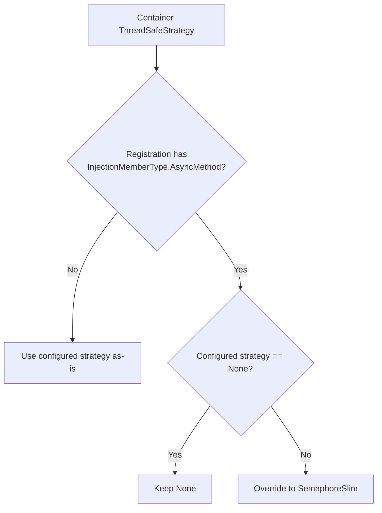

# Thread Safety

## Overview

Service resolution is thread-safe by default using `Lock` with double-checked locking pattern. The strategy can be configured via `ThreadSafeStrategy` property on `[IocContainer]` attribute.

## ThreadSafeStrategy Enum

The `ThreadSafeStrategy` enum controls how the container ensures thread-safe initialization of singleton and scoped services. This only affects services with `Singleton` or `Scoped` lifetime; `Transient` services always create new instances without caching.

|Strategy|Description|Use Case|
|:---|:---|:---|
|`None`|No thread safety. Direct field assignment without synchronization.|Single-threaded applications or when external synchronization is guaranteed. **Warning**: May create multiple instances in multi-threaded scenarios.|
|`Lock`|Uses `lock` statement with double-checked locking pattern. **(Default)**|General-purpose thread safety with balanced performance.|
|`SemaphoreSlim`|Uses `SemaphoreSlim` with double-checked locking pattern.|Only option for scenarios with async initialization.|
|`SpinLock`|Uses `SpinLock` with double-checked locking pattern.|High-performance scenarios with very short initialization times. Not recommended for I/O-bound initialization.|
|`CompareExchange`|Uses `Interlocked.CompareExchange` (CAS) for lock-free thread safety.|Best performance for lightweight constructors. No synchronization overhead. May create duplicate instances under contention; duplicates are disposed via `DisposeService`.|

## Async-init Strategy Override

Registrations that contain one or more `InjectionMemberType.AsyncMethod` members generate async-init resolver paths and cached fields of type `Task<T>`. Those resolver paths MUST use an async-compatible synchronization strategy.

### Effective Strategy Rules for Async-init Services

|Container `ThreadSafeStrategy`|Effective strategy for async-init field declarations and resolver methods|Required behavior|
|:---|:---|:---|
|`None`|`None`|The generator MUST preserve `None` as-is. This remains an explicit opt-in for single-threaded or externally synchronized usage.|
|`SemaphoreSlim`|`SemaphoreSlim`|The generator MUST use `SemaphoreSlim` for async-init services.|
|`Lock`|`SemaphoreSlim`|The generator MUST automatically override the configured strategy to `SemaphoreSlim` for async-init field declarations and resolver methods because `lock` cannot span `await`.|
|`SpinLock`|`SemaphoreSlim`|The generator MUST automatically override the configured strategy to `SemaphoreSlim` for async-init field declarations and resolver methods because `SpinLock` cannot span `await`.|
|`CompareExchange`|`SemaphoreSlim`|The generator MUST automatically override the configured strategy to `SemaphoreSlim` for async-init field declarations and resolver methods because the CAS path is not compatible with awaited first-initialization.|

> **Scope**: This override applies only to async-init services. Non-async resolver paths MUST continue to use the container's configured `ThreadSafeStrategy`.



### Example: `Lock` Container Strategy with Async-init Service

```csharp
#region Define:
using System.Threading.Tasks;

public interface IAsyncInitializer
{
    Task InitializeAsync(object instance);
}

[IocRegister(ServiceLifetime.Singleton)]
public sealed class MyService
{
    [IocInject]
    public async Task InitializeAsync(IAsyncInitializer initializer)
    {
        await initializer.InitializeAsync(this);
    }
}

[IocContainer(ThreadSafeStrategy = ThreadSafeStrategy.Lock)]
public partial class AppContainer;
#endregion

#region Generate:
partial class AppContainer
{
    private global::System.Threading.Tasks.Task<global::MyService>? _myService;
    private readonly global::System.Threading.SemaphoreSlim _myServiceSemaphore = new(1, 1);

    private async global::System.Threading.Tasks.Task<global::MyService> GetMyServiceAsync()
    {
        if(_myService is not null)
            return await _myService;

        await _myServiceSemaphore.WaitAsync();
        try
        {
            if(_myService is null)
            {
                _myService = CreateMyServiceAsync();
            }
        }
        finally
        {
            _myServiceSemaphore.Release();
        }

        return await _myService;
    }
}
#endregion
```

```csharp
// Invalid outcome (must not happen): async-init resolver paths cannot use lock-based strategies.
private readonly Lock _myServiceLock = new();
private async global::System.Threading.Tasks.Task<global::MyService> GetMyServiceAsync()
{
    lock(_myServiceLock)
    {
        _myService ??= CreateMyServiceAsync();
    }

    return await _myService;
}
```

## Generated Code Examples

### ThreadSafeStrategy.None

No synchronization primitives. Simple but not thread-safe:

```csharp
private global::MyService? _myService;
private global::MyService GetMyService()
{
    if (_myService is not null) return _myService;

    var instance = new global::MyService();
    _myService = instance;
    return instance;
}
```

### ThreadSafeStrategy.Lock (Default)

Uses `Lock` class with double-checked locking:

```csharp
private global::MyService? _myService;
private readonly Lock _myServiceLock = new();
private global::MyService GetMyService()
{
    if (_myService is not null) return _myService;

    lock (_myServiceLock)
    {
        if (_myService is not null) return _myService;

        var instance = new global::MyService();
        _myService = instance;
        return instance;
    }
}
```

### ThreadSafeStrategy.SemaphoreSlim

Uses `SemaphoreSlim` with double-checked locking:

```csharp
private global::MyService? _myService;
private readonly SemaphoreSlim _myServiceSemaphore = new(1, 1);
private global::MyService GetMyService()
{
    if (_myService is not null) return _myService;

    _myServiceSemaphore.Wait();
    try
    {
        if (_myService is not null) return _myService;

        var instance = new global::MyService();
        _myService = instance;
        return instance;
    }
    finally
    {
        _myServiceSemaphore.Release();
    }
}
```

### ThreadSafeStrategy.SpinLock

Uses `SpinLock` with double-checked locking. Note that `SpinLock` is a struct and must not be readonly:

```csharp
private global::MyService? _myService;
private SpinLock _myServiceSpinLock = new(false);
private global::MyService GetMyService()
{
    if (_myService is not null) return _myService;

    bool lockTaken = false;
    try
    {
        _myServiceSpinLock.Enter(ref lockTaken);
        if (_myService is not null) return _myService;

        var instance = new global::MyService();
        _myService = instance;
        return instance;
    }
    finally
    {
        if (lockTaken) _myServiceSpinLock.Exit();
    }
}
```

### ThreadSafeStrategy.CompareExchange

Uses `Interlocked.CompareExchange` for lock-free CAS (Compare-And-Swap) pattern. No synchronization field needed. Under contention, multiple instances may be created but only one is retained; losing instances are disposed via `DisposeService`:

```csharp
private global::MyService? _myService;
private global::MyService GetMyService()
{
    if (_myService is not null) return _myService;

    var instance = new global::MyService();

    var existing = Interlocked.CompareExchange(ref _myService, instance, null);
    if(existing is not null)
    {
        DisposeService(instance);
        return existing;
    }
    return instance;
}
```

## Field Generation by Strategy

Each strategy generates different synchronization fields:

|Strategy|Instance Field|Synchronization Field|Disposed|
|:---|:---|:---|:---|
|`None`|`private T? _field;`|None|N/A|
|`Lock`|`private T? _field;`|`private readonly Lock _fieldLock = new();`|No (no unmanaged resources)|
|`SemaphoreSlim`|`private T? _field;`|`private readonly SemaphoreSlim _fieldSemaphore = new(1, 1);`|**Yes** (in `Dispose`/`DisposeAsync`)|
|`SpinLock`|`private T? _field;`|`private SpinLock _fieldSpinLock = new(false);` (not readonly)|No (value type)|
|`CompareExchange`|`private T? _field;`|None|No|

> **Note**: Eager services use non-nullable fields (`private T _field;`) without synchronization fields, as they are initialized in the constructor.

## Scope Constructor Behavior

When creating a child scope, synchronization fields are NOT copied from parent. Each scope has its own synchronization primitives for scoped services:

```csharp
private AppContainer(AppContainer parent)
{
    _fallbackProvider = parent._fallbackProvider;
    _isRootScope = false;

    // Copy singleton instance references from parent (both eager and lazy)
    _eagerSingletonService = parent._eagerSingletonService;
    _lazySingletonService = parent._lazySingletonService;

    // Singleton synchronization fields are NOT copied (parent already initialized)
    // Scoped fields are fresh for each scope (both instance and sync fields)

    // Initialize eager scoped services
    _eagerScopedService = GetEagerScopedService();
}
```

## See Also

- [Service Lifetime Management](Container.Lifetime.spec.md)
- [Container Options](Container.Options.spec.md)
