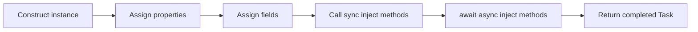

# Injection (Field / Property / Method / Constructor)

## Overview

Full support for member and constructor injection via `[IocInject]` and `[Inject]` attributes. The generator handles factory method generation when necessary and supports complex scenarios including optional parameters, keyed services, and wrapper types.

## Feature: Injection (Field / Property / Method / Constructor)

When a class marked with `IocRegisterAttribute`, `IocRegisterForAttribute` and its members or parameters marked with `IocInjectAttribute` or `InjectAttribute`, generate the necessary code to handle the injection.

Only check with name `IocInjectAttribute` or `InjectAttribute`, so user can use other library's attribute, like `Microsoft.AspNetCore.Components.InjectAttribute`, make sure the Key interpret logic is compatible with `Microsoft.AspNetCore.Components.InjectAttribute`.

### Factory Method Generation Requirements

**Important**: Factory method registration is only generated when necessary. The following cases require factory method:

- Constructor parameter has `[IocInject]` attribute (SourceGen.Ioc-specific, MS.E.DI cannot handle)
- Field/Property/Method has `[IocInject]` attribute
- Decorator pattern is used
- Factory or Instance is specified

The following cases are handled natively by MS.E.DI and do **NOT** require factory method:

- `[FromKeyedServices]` attribute on constructor parameters
- `[ServiceKey]` attribute on constructor parameters
- `IServiceProvider` parameter in constructor

### Method Parameter Analysis

Method parameters marked with `[IocInject]` must be analyzed using the same logic as constructor parameters:

- `[ServiceKey]` attribute: Inject the registration key (or default if non-keyed)
- `[FromKeyedServices]` attribute: Use keyed service resolution
- `[IocInject]` attribute with Key: Use keyed service resolution
- `IServiceProvider` type: Pass the service provider directly
- Collection types (`IEnumerable<T>`, `T[]`, `IReadOnlyList<T>`, etc.): Use `GetServices<T>()` or `GetKeyedServices<T>(key)`
- Wrapper types: Generate inline wrapper construction (see **Wrapper Type Resolution** below)
- Parameters with default values: See rule for optional parameters below

### Property/Field Analysis

Properties and fields marked with `[IocInject]` or `[Inject]` are analyzed for injection:

- Only non-static properties with a setter (`set` or `init`) are eligible
- Only non-static, non-readonly fields are eligible
- `[IocInject]` attribute with Key: Use keyed service resolution (`GetRequiredKeyedService<T>(key)` or `GetKeyedService<T>(key)`)
- `IServiceProvider` type: Pass the service provider directly
- Collection types (`IEnumerable<T>`, `T[]`, `IReadOnlyList<T>`, etc.): Use `GetServices<T>()` or `GetKeyedServices<T>(key)`
- Wrapper types: Generate inline wrapper construction (see **Wrapper Type Resolution** below)
- Nullable annotation (`T?`): Use `GetService<T>()` (non-required) instead of `GetRequiredService<T>()`
- Property/Field with initializer: Treated as having a default value, use optional resolution

### Optional Parameter Handling (constructor and method parameters)

When a parameter has a default value:

- Use `GetService<T>()` (non-required) and conditionally assign:
  - If the resolved value is not null: Use the resolved value
  - If the resolved value is null: Do not specify the argument (use default value)

### Wrapper Type Resolution

When a parameter or member type is a recognized wrapper type, the generator resolves it differently depending on whether it is a **direct wrapper** (inner type is a plain service) or a **nested wrapper** (inner type is itself a wrapper).

**Direct `Lazy<T>` / `Func<...>`**: Standalone registrations are emitted so wrapper services can be resolved directly from DI. Lifetimes and tags are inherited from the matched inner service `T`.

| Wrapper Type | Standalone Registration | Consumer Resolution |
| --- | --- | --- |
| `Lazy<T>` | `services.AddXXX<Lazy<T>>(sp => new Lazy<T>(() => sp.GetRequiredService<T>()))` | `sp.GetRequiredService<Lazy<T>>()` |
| `Func<T>` | `services.AddXXX<Func<T>>(sp => new Func<T>(() => sp.GetRequiredService<T>()))` | `sp.GetRequiredService<Func<T>>()` |
| `Func<T1, ..., TReturn>` | `services.AddXXX<Func<T1,...,TReturn>>(sp => new Func<T1,...,TReturn>((arg0,...) => ...))` | `sp.GetRequiredService<Func<T1,...,TReturn>>()` |
| `KeyValuePair<K, V>` | `services.Add(new ServiceDescriptor(typeof(KVP<K,V>), sp => ..., lifetime))` | (used by Dictionary resolution) |
| `IDictionary<K, V>` | — | `sp.GetServices<KeyValuePair<K, V>>().ToDictionary(...)` |
| `IReadOnlyDictionary<K, V>` | — | `sp.GetServices<KeyValuePair<K, V>>().ToDictionary(...)` |
| `Dictionary<K, V>` | — | `sp.GetServices<KeyValuePair<K, V>>().ToDictionary(...)` |

- **Nullable wrapper types**: Use `GetService<T>()` (optional) instead of `GetRequiredService<T>()`
- **Nested wrappers**: Non-collection outer wrappers (`Lazy<T>`, `Func<T>`) are recursively resolved to arbitrary depth via inline construction. Collection outer wrappers support at most **1 level of inner wrapping** (2 levels total). Inner wrapper types are constructed **inline** (no standalone registration).
  - `Lazy<Func<T>>` → `new Lazy<Func<T>>(() => new Func<T>(() => sp.GetRequiredService<T>()))`
  - `Func<Lazy<T>>` → `new Func<Lazy<T>>(() => new Lazy<T>(() => sp.GetRequiredService<T>()))`
  - `Lazy<IEnumerable<T>>` → `new Lazy<IEnumerable<T>>(() => sp.GetServices<T>())`
  - `IEnumerable<Lazy<T>>` / `IEnumerable<Func<T>>` — Consumers resolve via `sp.GetServices<Lazy<T>>()` (uses standalone registrations)
  - Collection outer wrapper with 3+ levels (e.g., `IEnumerable<Lazy<Func<T>>>`) is **not** supported. No wrapper registrations are emitted; the consumer is registered with a plain `AddXXX<Consumer, Consumer>()` call and the parameter is left to MS.DI runtime resolution.
  - `ValueTask<T>` is **not** a recognized wrapper type in any context. Only `Task<T>` is supported for async-init wrapping. When used as a partial accessor return type: if the target service uses async-init, `SGIOC029` is reported; otherwise `SGIOC021` is reported.
- **Multi-parameter Func matching**: For `Func<T1,...,TN-1,TReturn>`, constructor parameters and injectable members are matched by type against Func inputs using first-unused semantics. Unmatched dependencies are resolved from DI.
- **Nested multi-parameter Func**: Not supported (e.g., `Lazy<Func<string, IService>>` with input parameters).
- **Open generic dependencies**: Wrapper inner types that reference closed generics trigger automatic closed generic registration (e.g., `Lazy<IHandler<TestEntity>>` → registers `Handler<TestEntity>`)
- **Factory method requirement**: Only **nested** wrapper types and **nullable** direct Lazy/Func types trigger factory method registration. Direct non-nullable Lazy/Func types resolve from their standalone registrations.
- **Tag-awareness**: Standalone `Lazy<T>`/`Func<T>`/`KeyValuePair<K, T>` registrations inherit the tags of the inner service `T` and are emitted within the same tag conditional block.

### Async Method Injection

`AsyncMethodInject` extends post-construction member injection with awaited initialization methods. The generator MUST treat async method injection as a distinct injection stage that runs after all synchronous injection steps.

#### Classification Rules

|Condition|Required behavior|
|:--------|:----------------|
|Method has `[IocInject]`/`[Inject]`, is an ordinary instance method, returns non-generic `Task`, and `AsyncMethodInject` is enabled|MUST classify the member as `InjectionMemberType.AsyncMethod`.|
|Method has `[IocInject]`/`[Inject]` and returns `void`|MUST continue to classify the member as `InjectionMemberType.Method`.|
|Method returns `Task<T>`|MUST NOT classify the member as async method injection. `Task<T>` is not a supported injection-method return type.|
|Method returns `ValueTask` or `ValueTask<T>`|MUST NOT classify the member as async method injection.|
|Method returns `Task` but `AsyncMethodInject` is disabled|The generator MUST treat the member as feature-gated; the analyzer owns the user-facing warning via `SGIOC022`.|

#### Ordering Contract

The generator MUST emit member injection in the following fixed stage order. Source declaration order applies **within** each stage.

|Stage|Members|Emission rule|
|:----|:------|:------------|
|1|Properties|MUST be assigned first, in source declaration order.|
|2|Fields|MUST be assigned second, in source declaration order.|
|3|Synchronous methods|MUST be invoked third, in source declaration order.|
|4|Async methods|MUST be awaited last, in source declaration order.|



#### Register-Path Generation

When a registration contains one or more async inject methods, the registration generator MUST emit a `Task<TService>` registration. The generated factory MUST create an `async Task<TImplementation> Init(...)` local function, perform synchronous injection first, then `await` each async inject method in stage order.

```csharp
#region Define:
using System.Threading.Tasks;

public interface ILogger { }
public interface IAsyncInitializer
{
    Task InitializeAsync();
}

public interface IMyService { }

[IocRegister(ServiceTypes = [typeof(IMyService)], Lifetime = ServiceLifetime.Singleton)]
public class MyService : IMyService
{
    [IocInject]
    public ILogger Logger { get; set; } = default!;

    [IocInject]
    public void InitializeSync()
    {
    }

    [IocInject]
    public async Task InitializeAsync(IAsyncInitializer initializer)
    {
        await initializer.InitializeAsync();
    }
}
#endregion

#region Generate:
services.AddSingleton<Task<IMyService>>(sp =>
{
    async Task<global::MyService> Init(global::System.IServiceProvider provider)
    {
        var initializer = provider.GetRequiredService<global::IAsyncInitializer>();
        var instance = new global::MyService
        {
            Logger = provider.GetRequiredService<global::ILogger>(),
        };

        instance.InitializeSync();
        await instance.InitializeAsync(initializer);
        return instance;
    }

    return Init(sp);
});
#endregion
```

#### `WrapperKind.Task` Detection and Resolution

`Task<T>` is the async-init wrapper for consumer dependencies and partial accessors. The generator MUST only recognize the direct, non-nested form. Resolution MUST distinguish whether `T` itself has an async-init service path or only a synchronous service path.

|Requested type|Classification|Resolution behavior|
|:-------------|:-------------|:------------------|
|`Task<T>` where `T` is a non-wrapper service type|`WrapperKind.Task`|MUST classify as `WrapperKind.Task`. Resolution MUST follow the async-init vs. sync-only rules below.|
|`Task<Lazy<T>>`|Unsupported|MUST NOT be classified as `WrapperKind.Task`.|
|`Lazy<Task<T>>`|Unsupported|MUST NOT be classified as a supported nested wrapper combination.|
|`IEnumerable<Task<T>>`|Unsupported|MUST NOT be classified as a supported collection wrapper.|

|Inner service `T` shape|Register-path behavior|Container-path behavior|
|:----------------------|:---------------------|:----------------------|
|Async-init service (`T` resolves through generated `Task<T>` init path)|MUST resolve `Task<T>` directly via `sp.GetRequiredService<Task<T>>()` or `sp.GetService<Task<T>>()`, depending on requiredness/default handling rules.|MUST call the generated async resolver path for `Task<T>` directly.|
|Sync-only service (`T` only has synchronous resolution)|MUST wrap the synchronous resolution as `Task.FromResult(sp.GetRequiredService<T>())` or the matching optional/default-aware `Task.FromResult(...)` form.|MUST wrap the sync resolver result as `Task.FromResult(self.GetT_Resolve())` or the equivalent generated sync resolver call.|

```csharp
// Invalid: nested async wrappers are not supported.
[IocRegister]
public class BadConsumer
{
    [IocInject]
    public void Initialize(Task<Lazy<IMyService>> service)
    {
    }
}
```

### Examples

**Basic Injection**:

```csharp
#region Define:
[IocRegister]
public class MyService([Inject(Key = 10)]IMayServiceDependency1 sd)
{
    private readonly IMayServiceDependency1 sd = sd;

    [Inject]
    public IMayServiceDependency2 Dependency { get; init; }

    [Inject]
    public void Initialize(IMayServiceDependency3 sd3)
    {
        // Initialization code
    }
}
#endregion

#region Generate:
public static class ServiceCollectionExtensions
{
    public static IServiceCollection Add{ProjectName}(this IServiceCollection services)
    {
            services.AddSingleton<MyService>((IServiceProvider sp) =>
            {
                var s0_p0 = sp.GetRequiredKeyedService<IMayServiceDependency1>(10);
                var s0_p1 = sp.GetRequiredService<IMayServiceDependency2>();
                var s0_p2 = sp.GetRequiredService<IMayServiceDependency3>();
                var s0 = new MyService(s0_p0) { Dependency = s0_p1 };
                s0.Initialize(s0_p2);
                return s0;
            });
            return services;
    }
}
#endregion
```

**Method with `[ServiceKey]` and `[FromKeyedServices]` on parameters**:

```csharp
#region Define:
[IocRegister(Key = "MyKey")]
public class MyService : IMyService
{
    public IDependency? Dep { get; private set; }
    public string? Key { get; private set; }

    [IocInject]
    public void Initialize(
        [FromKeyedServices("special")] IDependency dep,
        [ServiceKey] string key,
        IServiceProvider sp)
    {
        Dep = dep;
        Key = key;
    }
}
#endregion

#region Generate:
services.AddKeyedSingleton<MyService>("MyKey", (global::System.IServiceProvider sp, object? key) =>
{
    var s0_m0 = sp.GetRequiredKeyedService<IDependency>("special");
    var s0_m1 = "MyKey";
    var s0 = new MyService();
    s0.Initialize(s0_m0, s0_m1, sp);
    return s0;
});
#endregion
```

**Optional parameters with default values**:

```csharp
#region Define:
[IocRegister]
public class MyService : IMyService
{
    public IOptionalDependency? OptDep { get; private set; }

    [IocInject]
    public void Initialize(IOptionalDependency? optDep = null, int timeout = 30)
    {
        OptDep = optDep;
    }
}
#endregion

#region Generate:
services.AddSingleton<MyService>((global::System.IServiceProvider sp) =>
{
    var s0_m0 = sp.GetService<IOptionalDependency>();
    var s0_m1 = (int)(sp.GetService(typeof(int)) ?? 30);
    var s0 = new MyService();
    // Use named argument only when value is not null
    if (s0_m0 is not null)
    {
        s0.Initialize(optDep: s0_m0, timeout: s0_m1);
    }
    else
    {
        s0.Initialize(timeout: s0_m1);
    }
    return s0;
});
#endregion
```

**Constructor with optional resolvable parameter**:

```csharp
#region Define:
[IocRegister]
public class MyService(IOptionalDependency? optDep = null) : IMyService
{
    public IOptionalDependency? OptDep { get; } = optDep;
}
#endregion

#region Generate:
services.AddSingleton<MyService>((global::System.IServiceProvider sp) =>
{
    var p0 = sp.GetService<IOptionalDependency>();
    // Use named argument only when value is not null
    var s0 = p0 is not null ? new MyService(optDep: p0) : new MyService();
    return s0;
});
#endregion
```

**Property and Field injection with nullable and keyed services**:

```csharp
#region Define:
[IocRegister]
public class MyService : IMyService
{
    // Required property injection with key
    [IocInject(Key = "special")]
    public IDependency Dep { get; init; }

    // Nullable property injection (uses GetService instead of GetRequiredService)
    [Inject]
    public IOptionalDependency? OptionalDep { get; set; }

    // Property with initializer (treated as optional)
    [Inject]
    public ILogger Logger { get; set; } = NullLogger.Instance;

    // Field injection
    [Inject]
    private IServiceProvider _serviceProvider;
}
#endregion

#region Generate:
services.AddSingleton<MyService>((global::System.IServiceProvider sp) =>
{
    var s0_dep = sp.GetRequiredKeyedService<IDependency>("special");
    var s0_optDep = sp.GetService<IOptionalDependency>();
    var s0_logger = sp.GetService<ILogger>();
    var s0 = new MyService
    {
        Dep = s0_dep,
        OptionalDep = s0_optDep,
        Logger = s0_logger ?? NullLogger.Instance,
        _serviceProvider = sp
    };
    return s0;
});
#endregion
```

**MS.E.DI native handling example (no factory needed)**:

```csharp
#region Define:
[IocRegister<IMyService>]
public class MyService(
    [FromKeyedServices("special")] IDependency dep,  // MS.E.DI handles [FromKeyedServices]
    IServiceProvider sp                              // MS.E.DI handles IServiceProvider
) : IMyService;
#endregion

#region Generate:
// Simple type-based registration - MS.E.DI handles the special parameters automatically
services.AddSingleton<MyService, MyService>();
services.AddSingleton<IMyService, MyService>();
#endregion
```

**Wrapper type resolution**:

```csharp
#region Define:
[IocRegister(Lifetime = ServiceLifetime.Singleton)]
public class Consumer(Lazy<IMyService> lazyService, Func<IOtherService> factory) { }
#endregion

#region Generate:
// Standalone wrapper registrations
services.AddSingleton<Lazy<IMyService>>(sp => new Lazy<IMyService>(() => sp.GetRequiredService<IMyService>()));
services.AddSingleton<Func<IOtherService>>(sp => new Func<IOtherService>(() => sp.GetRequiredService<IOtherService>()));

// Consumer resolves wrappers from DI
services.AddSingleton<Consumer>((IServiceProvider sp) =>
{
    var p0 = sp.GetRequiredService<global::System.Lazy<IMyService>>();
    var p1 = sp.GetRequiredService<global::System.Func<IOtherService>>();
    var s0 = new Consumer(p0, p1);
    return s0;
});
#endregion
```

## See Also

- [Decorators](Register.Decorators.spec.md)
- [Factory Method Registration](Register.Factory.spec.md)
- [Container Injection](Container.Injection.spec.md)
