# IocSourceGenerator Specification

Source generators for compile-time IoC container generation based on `Microsoft.Extensions.DependencyInjection.Abstractions`. This Overview page provides index and consolidated specification data. Feature documentation is split into focused spec files under `Register.*.md` and `Container.*.md`.

## Spec Index

Find detailed documentation for each feature:

### Registration Features

|Feature|File|Description|
|:---|:---|:---|
|Basic Registration|[Register.Basic.spec.md](Register.Basic.spec.md)|Core service registration patterns including implementation types and keyed services|
|Decorators|[Register.Decorators.spec.md](Register.Decorators.spec.md)|Decorator pattern for composing services with multiple layers|
|Tags|[Register.Tags.spec.md](Register.Tags.spec.md)|Tag-based mutually exclusive service registration|
|Injection Members|[Register.Injection.spec.md](Register.Injection.spec.md)|Field, property, method, and constructor injection patterns|
|Imported Modules|[Register.ImportModule.spec.md](Register.ImportModule.spec.md)|Cross-assembly module importing and sharing registrations|
|Open Generics|[Register.Generics.spec.md](Register.Generics.spec.md)|Generic service types, closed generic discovery, and generic factory mapping|
|IServiceProvider|[Register.ServiceProviderInvocation.spec.md](Register.ServiceProviderInvocation.spec.md)|Automatic service discovery from IServiceProvider invocations|
|MSBuild Configuration|[Register.MSBuild.spec.md](Register.MSBuild.spec.md)|MSBuild property configuration for generator behavior|
|Factory & Instance|[Register.Factory.spec.md](Register.Factory.spec.md)|Factory method and static instance registration|
|KeyValuePair|[Register.KeyValuePair.spec.md](Register.KeyValuePair.spec.md)|KeyValuePair and Dictionary registrations for keyed service collections|

### Container Features

|Feature|File|Description|
|:---|:---|:---|
|Basic Container|[Container.Basic.spec.md](Container.Basic.spec.md)|Generated container overview and service resolution|
|Service Lifetime|[Container.Lifetime.spec.md](Container.Lifetime.spec.md)|Singleton, Scoped, and Transient lifecycle management|
|Keyed Services|[Container.KeyedServices.spec.md](Container.KeyedServices.spec.md)|Keyed service resolution with multiple key types|
|Injection|[Container.Injection.spec.md](Container.Injection.spec.md)|Constructor, property, field, and method injection in containers|
|Decorators|[Container.Decorators.spec.md](Container.Decorators.spec.md)|Decorator ordering and composition within containers|
|Imported Modules|[Container.ImportModule.spec.md](Container.ImportModule.spec.md)|FrozenDictionary-based service resolution with module composition|
|Factory & Instance|[Container.Factory.spec.md](Container.Factory.spec.md)|Factory-created and static instance service handling|
|Open Generics|[Container.Generics.spec.md](Container.Generics.spec.md)|Open generic service resolution|
|Collections & Wrappers|[Container.Collections.spec.md](Container.Collections.spec.md)|Collection types (IEnumerable, arrays) and wrapper types (Lazy, Func, KeyValuePair)|
|Container Options|[Container.Options.spec.md](Container.Options.spec.md)|Configuration attributes and behavior flags (IntegrateServiceProvider, ExplicitOnly, etc.)|
|Thread Safety|[Container.ThreadSafety.spec.md](Container.ThreadSafety.spec.md)|Thread-safe service initialization strategies (Lock, SemaphoreSlim, SpinLock, CompareExchange)|
|Partial Accessors|[Container.PartialAccessors.spec.md](Container.PartialAccessors.spec.md)|Fast-path service resolution via partial members|
|MVC & Blazor|[Container.AspNetCore.spec.md](Container.AspNetCore.spec.md)|IControllerActivator, IComponentActivator, and IComponentPropertyActivator support|
|Performance|[Container.Performance.spec.md](Container.Performance.spec.md)|Disposal order, eager resolution, and code generation efficiency|

## Collecting Information

### 1. Registration Attributes

|Attribute|Purpose|Generic Version|
|:--------|:------|:--------------|
|`IocRegisterAttribute`|Mark class for registration|`IocRegisterAttribute<T>`|
|`IocRegisterForAttribute`|Register external types|`IocRegisterForAttribute<T>`|
|`IocRegisterDefaultsAttribute`|Default settings for registrations|`IocRegisterDefaultsAttribute<T>`|
|`IocImportModuleAttribute`|Import other assembly's settings|`IocImportModuleAttribute<T>`|
|`IocDiscoverAttribute`|Explicit closed generic discovery|`IocDiscoverAttribute<T>`|
|`IocGenericFactoryAttribute`|Generic factory type mapping|—|

### 2. Registration Properties

|Property|Source|
|:-------|:-----|
|Service Type|`TargetServiceType`, `ServiceTypes`, `RegisterAllInterfaces`, `RegisterAllBaseClasses`|
|Implementation Type|`IocRegisterForAttribute.ImplementationType`, marked class, defaults `ImplementationTypes`|
|Lifetime|Attribute → defaults → MSBuild `SourceGenIocDefaultLifetime` → `Transient`|
|Key / KeyType|Attribute → defaults|
|KeyValueType|Resolved `TypeData` of the key value (e.g., `string`, enum, `Guid`). `null` when `KeyType=Csharp` without `nameof()`|
|Decorators|`Decorators` property (with constructor params and type constraints)|
|Tags|Attribute → defaults|
|Factory|`Factory` property (method path, supports generic mapping)|
|Instance|`Instance` property (static instance path, e.g., `"MyService.Default"`)|
|ValidOpenGenericServiceTypes|Set of valid open generic service type names for constraint checking|

### 3. Type Hierarchy Collection

|Data|Description|
|:---|:----------|
|`AllInterfaces`|All interfaces implemented by the type|
|`AllBaseClasses`|All base classes (excluding `System.Object`)|
|`TypeParameters`|Generic type parameters with constraints|
|`ConstructorParameters`|Constructor parameters (for decorators)|
|`WrapperKind`|`None`, `Enumerable`, `ReadOnlyCollection`, `Collection`, `ReadOnlyList`, `List`, `Array`, `Lazy`, `Func`, `Dictionary`, or `KeyValuePair`|

### 4. Injection Members

|Member Type|Resolution|
|:----------|:---------|
|Property|With `[IocInject]`/`[Inject]`, set via object initializer|
|Field|With `[IocInject]`/`[Inject]`, set via object initializer|
|Method|With `[IocInject]`/`[Inject]`, called after construction|

### 5. IServiceProvider Invocations

Collect service types from invocations: `GetService<T>`, `GetRequiredService<T>`, `GetKeyedService<T>`, `GetRequiredKeyedService<T>`, `GetServices<T>`, `GetKeyedServices<T>` (and non-generic overloads)

### 6. Compilation Info

|Property|Source|
|:-------|:-----|
|Root Namespace|MSBuild `RootNamespace` (fallback: assembly name)|
|Assembly Name|Compilation options|
|Custom Method Name|`SourceGenIocName` MSBuild property|
|Default Lifetime|`SourceGenIocDefaultLifetime` MSBuild property (fallback: Transient)|
|Features|`SourceGenIocFeatures` MSBuild property (fallback: `Register,Container,PropertyInject,MethodInject`)|

### 7. Feature Flags

The `SourceGenIocFeatures` MSBuild property controls which outputs and injection member kinds are generated.

Available features:

|Feature|Description|
|:------|:----------|
|`Register`|Enable generation of the registration extension method output|
|`Container`|Enable generation of the container class output|
|`PropertyInject`|Enable property injection member generation|
|`FieldInject`|Enable field injection member generation|
|`MethodInject`|Enable method injection member generation|

Default value:

`Register,Container,PropertyInject,MethodInject`

Behavior:

- `Register`: Controls whether the registration extension method output is generated.
- `Container`: Controls whether the container class output is generated.
- `PropertyInject` / `FieldInject` / `MethodInject`: Control which injection member types are included in generated code.

Parsing rules:

- Comma-separated values.
- Case-insensitive matching.
- Whitespace is trimmed around each value.
- Invalid values are ignored.

## Parse Logic

### 1. Key Interpretation

|KeyType|Behavior|Example|
|:------|:-------|:------|
|`Value`|Use literal value|`42`, `"myString"`, `MyEnum.Value`|
|`Csharp`|Evaluate as C# expression|`MyClass.StaticField`, `nameof(...)`|

### 2. Default Settings Priority

When multiple defaults match an implementation type:

1. Directly on implementation type
2. On closest base class
3. On first interface in `AllInterfaces`

### 2.1 Service Type Determination for `ImplementationTypes`

When `IocRegisterDefaults` provides `ImplementationTypes`, the generator derives service types per implementation with the following rules:

|Condition|Behavior|
|:--------|:-------|
|Implementation type is open generic|MUST use `TargetServiceType` and append configured `ServiceTypes` (if any).|
|Implementation type is closed generic or non-generic and matching closed types are found from `AllInterfaces`/`AllBaseClasses`|MUST use those matched closed types as service types.|
|Implementation type is closed generic or non-generic and no closed type matches `TargetServiceType` (for example, framework metadata is not visible during generation)|MUST fall back to `TargetServiceType` directly instead of leaving `ServiceTypes` empty.|

This fallback is required for scenarios such as Razor components where `IComponent` might not be visible to the source generator from the implementation type hierarchy.

```csharp
// Valid: fallback to TargetServiceType when the hierarchy scan cannot resolve IComponent.
[assembly: IocRegisterDefaults(
    typeof(Microsoft.AspNetCore.Components.IComponent),
    ServiceLifetime.Scoped,
    ImplementationTypes = [typeof(MyAppComponent)])]

public partial class MyAppComponent : Microsoft.AspNetCore.Components.ComponentBase
{
}
```

```csharp
// Invalid outcome (must not happen): ServiceTypes becomes empty for MyAppComponent.
// Required behavior is to include TargetServiceType as fallback.
```

### 3. Settings Merge Order

`Explicit attribute` → `Matching defaults` → `MSBuild SourceGenIocDefaultLifetime` → `Transient`

### 4. Inject Attribute Matching

Match by name only: `IocInjectAttribute` or `InjectAttribute`  
(Supports third-party attributes like `Microsoft.AspNetCore.Components.InjectAttribute`)

### 5. Constructor Selection

|Priority|Condition|
|-------:|:--------|
|1|Marked with `[IocInject]`|
|2|Primary constructor|
|3|Constructor with most parameters|

### 6. Parameter Resolution

|Condition|Action|
|:--------|:-----|
|`[ServiceKey]` attribute|Inject registration key|
|`[FromKeyedServices]` or `[IocInject(Key=...)]`|Keyed service resolution|
|`IServiceProvider` type|Pass provider directly|
|Collection types (`IEnumerable<T>`, `T[]`, etc.)|Extract `T` as service type|

### 7. Property/Field Injection

Only members with `[IocInject]` or `[Inject]`:

|Condition|Behavior|
|:--------|:-------|
|With `Key`|Keyed service resolution|
|`IServiceProvider`|Pass provider directly|
|Collection types|Extract inner type as service|
|Nullable type|Assign resolved nullable value|
|Has default value|Use resolved if non-null|

### 8. Wrapper Kind Resolution

`WrapperKind` is a unified enum. Each value has a dedicated `TypeData` derived type.

|`WrapperKind`|TypeData Type|Types|Resolution|
|:------------|:------------|:----|:---------|
|`Enumerable`|`EnumerableTypeData`|`IEnumerable<T>`|MS.E.DI native collection support|
|`ReadOnlyCollection`|`ReadOnlyCollectionTypeData`|`IReadOnlyCollection<T>`|`GetServices<T>().ToArray()`|
|`Collection`|`CollectionTypeData`|`ICollection<T>`|`GetServices<T>().ToArray()`|
|`ReadOnlyList`|`ReadOnlyListTypeData`|`IReadOnlyList<T>`|`GetServices<T>().ToArray()`|
|`List`|`ListTypeData`|`IList<T>`|`GetServices<T>().ToArray()`|
|`Array`|`ArrayTypeData`|`T[]`|`GetServices<T>().ToArray()`|
|`Lazy`|`LazyTypeData`|`Lazy<T>`|Lazy-initialized service wrapper|
|`Func`|`FuncTypeData`|`Func<T>` / `Func<T1,...,TReturn>`|Factory delegate wrapper|
|`Dictionary`|`DictionaryTypeData`|`IDictionary<TKey, TValue>`|Dictionary of keyed services|
|`KeyValuePair`|`KeyValuePairTypeData`|`KeyValuePair<TKey, TValue>`|Single keyed service entry|

#### Type Hierarchy

```tree
TypeData
└── GenericTypeData
    ├── TypeParameterTypeData
    └── WrapperTypeData (WrapperKind)
        ├── CollectionWrapperTypeData
        │   ├── EnumerableTypeData          (Enumerable)
        │   ├── ReadOnlyCollectionTypeData  (ReadOnlyCollection)
        │   ├── CollectionTypeData          (Collection)
        │   ├── ReadOnlyListTypeData        (ReadOnlyList)
        │   ├── ListTypeData                (List)
        │   └── ArrayTypeData               (Array)
        ├── LazyTypeData                    (Lazy)
        ├── FuncTypeData                    (Func)
        ├── DictionaryTypeData              (Dictionary)
        └── KeyValuePairTypeData            (KeyValuePair)
```

Wrapper types support nesting. For example, `IEnumerable<Lazy<IMyService>>` is parsed as:

- `EnumerableTypeData` (`WrapperKind.Enumerable`)
  - `TypeParameters[0].Type` = `LazyTypeData` (`WrapperKind.Lazy`)
    - `TypeParameters[0].Type` = `TypeData` (`IMyService`)

### 9. Generic Factory Type Mapping

`IocGenericFactoryAttribute` maps service type parameters to factory method type parameters:

```csharp
// Single type parameter: IRequestHandler<>
[IocRegisterDefaults(typeof(IRequestHandler<>), Factory = nameof(Create))]
public class FactoryContainer
{
    // typeof(int) is placeholder, maps to T
    [IocGenericFactory(typeof(IRequestHandler<Task<int>>), typeof(int))]
    public static IRequestHandler<T> Create<T>() => new Handler<T>();
}

// Multiple type parameters: IRequestHandler<,>
[IocRegisterDefaults(typeof(IRequestHandler<,>), Factory = nameof(Create))]
public class FactoryContainer
{
    // decimal → T1, int → T2
    [IocGenericFactory(typeof(IRequestHandler<Task<int>, decimal>), typeof(decimal), typeof(int))]
    public static IRequestHandler<T1, T2> Create<T1, T2>() => new Handler<T1, T2>();
}
```

## Generators

1. Registration generator: generate `IServiceCollection` register code.\
[Registration features spec](#registration-features)

2. Container generator: generate container that implement `IServiceProvider`.\
[Container features spec](#container-features)

## Implementation Requirements

### Source Generator Architecture

Implemented at `IocSourceGenerator`, using the Incremental Generator pattern.
The generated code requires .NET 10.0 or later.

```filetree
src/SourceGen.Ioc.SourceGenerator/
├── Generator/
│   ├── IocSourceGenerator.cs              # Main generator (partial) with Initialize()
│   ├── Transform*.cs                      # Attribute → model transforms (Register, DefaultSettings, ImportModule, Discover, Container)
│   ├── ProcessSingleRegistration.cs       # Apply defaults to individual registrations
│   ├── CombineAndResolveClosedGenerics.cs # Combine results & resolve closed generics from open generics
│   ├── IServiceProviderInvocations.cs     # Collect IServiceProvider invocations
│   ├── GroupRegistrationsForContainer.cs  # Group registrations for container generation
│   ├── Generate*Output.cs                 # Code emitters (Register, Container)
│   ├── LazyRegistrationHelper.cs          # Lazy wrapper registration helper
│   ├── FuncRegistrationHelper.cs          # Func wrapper registration helper
│   ├── KvpRegistrationHelper.cs           # KeyValuePair registration helper
│   └── Spec/                              # SPEC.spec.md + Register.*.md + Container.*.md
├── Models/                                # Immutable data models (RegistrationData, TypeData, etc.)
└── Analyzer/                              # Diagnostic analyzers & SPEC.spec.md
```

### Data Flow

```mermaid
flowchart TB
    subgraph IocSourceGenerator.Initialize
        subgraph Attribute Providers
            IocRegister["[IocRegister]"]
            IocRegisterFor["[IocRegisterFor]"]
            IocRegisterDefaults["[IocRegisterDefaults]"]
            IocImportModule["[IocImportModule]"]
            IocDiscover["[IocDiscover]"]
            Invocations["IServiceProvider Invocations"]
            IocContainer["[IocContainer]"]
        end

        subgraph Default Settings
            allDefaultSettings["allDefaultSettings"]
            allImportedDefaultSettings["allImportedDefaultSettings"]
            combinedDefaultSettings["combinedDefaultSettings<br/>(DefaultSettingsMap)"]
        end

        subgraph Registration Pipeline
            allBasicResults["allBasicResults<br/>ImmutableEquatableArray#lt;ServiceRegistrationWithTags#gt;"]
            combinedClosedGenericDependencies["combinedClosedGenericDependencies<br/>(Invocations + Discover)"]
            allOpenGenericEntries["allOpenGenericEntries<br/>(Factory-based + Imported)"]
            CombineResolve["CombineAndResolveClosedGenerics"]
            serviceRegistrations["serviceRegistrations<br/>ImmutableEquatableArray#lt;ServiceRegistrationWithTags#gt;"]
        end

        subgraph Container Pipeline
            ContainerModel["ContainerModel"]
            CombineGroup["Combine & Group<br/>(GroupRegistrationsForContainer)"]
            ContainerWithGroups["ContainerWithGroups"]
        end

        subgraph Output Generation
            GenerateRegisterOutput["GenerateRegisterOutput<br/>(.ServiceRegistration.g.cs)"]
            GenerateContainerOutput["GenerateContainerOutput<br/>(.Container.g.cs)"]
        end

        IocRegisterDefaults --> allDefaultSettings
        IocRegisterDefaults -->|OpenGenericEntries| allOpenGenericEntries
        IocImportModule --> allImportedDefaultSettings
        IocImportModule -->|OpenGenericEntries| allOpenGenericEntries
        allDefaultSettings --> combinedDefaultSettings
        allImportedDefaultSettings --> combinedDefaultSettings

        IocRegister --> allBasicResults
        IocRegisterFor --> allBasicResults
        IocRegisterDefaults -->|ImplementationTypes| allBasicResults
        combinedDefaultSettings -.->|applied to| allBasicResults

        IocDiscover --> combinedClosedGenericDependencies
        Invocations --> combinedClosedGenericDependencies

        allBasicResults --> CombineResolve
        combinedClosedGenericDependencies --> CombineResolve
        allOpenGenericEntries --> CombineResolve
        CombineResolve --> serviceRegistrations

        IocContainer --> ContainerModel
        ContainerModel --> CombineGroup
        serviceRegistrations --> CombineGroup
        CombineGroup --> ContainerWithGroups

        serviceRegistrations --> GenerateRegisterOutput
        ContainerWithGroups --> GenerateContainerOutput
    end
```


