# IocSourceGenerator Specification

Source generators for compile-time IoC container generation based on `Microsoft.Extensions.DependencyInjection.Abstractions`. This Overview page provides index and consolidated specification data. Feature documentation is split into focused spec files under `Register.*.md` and `Container.*.md`.

## Pipeline Architecture

### Entry Point

`IocSourceGenerator` — `sealed partial class` implementing `IIncrementalGenerator`
File: `Generator/IocSourceGenerator.cs`

### Pipeline Overview

```text
ForAttributeWithMetadataName
├── IocRegisterAttribute        → RegistrationData
├── IocRegisterForAttribute     → RegistrationData
├── IocRegisterDefaultsAttribute→ DefaultSettingsResult
├── IocImportModuleAttribute    → ImportModuleResult
├── IocDiscoverAttribute        → ClosedGenericDependency
└── IocContainerAttribute       → ContainerModel
         ↓
    ProcessSingleRegistration → BasicRegistrationResult
         ↓
    CombineAndResolveClosedGenerics → ServiceRegistrationWithTags
         ↓
    GroupRegistrationsForRegister → RegisterOutputModel
         ↓
    GenerateRegisterOutput  →  {assemblyName}.ServiceRegistration.g.cs
    GenerateContainerOutput →  {containerClassName}.Container.g.cs
```

### Stage 1: Attribute Detection and Extraction

Uses `ForAttributeWithMetadataName` providers + one `CreateSyntaxProvider` for `IServiceProvider` invocations.

| Attribute | Transform Method | Output Type | File |
| :-------- | :--------------- | :---------- | :--- |
| `IocRegisterAttribute` | `TransformRegister` | `RegistrationData?` | `TransformRegister.cs` |
| `IocRegisterAttribute<T>` | `TransformRegisterGeneric` | `RegistrationData?` | `TransformRegister.cs` |
| `IocRegisterForAttribute` | `TransformRegisterFor` | `IEnumerable<RegistrationData>` | `TransformRegister.cs` |
| `IocRegisterForAttribute<T>` | `TransformRegisterForGeneric` | `IEnumerable<RegistrationData>` | `TransformRegister.cs` |
| `IocRegisterDefaultsAttribute` | `TransformDefaultSettings` | `IEnumerable<DefaultSettingsResult>` | `TransformDefaultSettings.cs` |
| `IocRegisterDefaultsAttribute<T>` | `TransformDefaultSettingsGeneric` | `IEnumerable<DefaultSettingsResult>` | `TransformDefaultSettings.cs` |
| `IocImportModuleAttribute` | `TransformImportModule` | `IEnumerable<ImportModuleResult>` | `TransformImportModule.cs` |
| `IocImportModuleAttribute<T>` | `TransformImportModuleGeneric` | `IEnumerable<ImportModuleResult>` | `TransformImportModule.cs` |
| `IocDiscoverAttribute` | `TransformDiscover` | `IEnumerable<ClosedGenericDependency>` | `TransformDiscover.cs` |
| `IocDiscoverAttribute<T>` | `TransformDiscoverGeneric` | `IEnumerable<ClosedGenericDependency>` | `TransformDiscover.cs` |
| `GetService`/`GetRequiredService`/etc. | `TransformInvocations` | `IEnumerable<ClosedGenericDependency>` | `IServiceProviderInvocations.cs` |

### Stage 2: Data Model Combination

Combines default settings and import module pipelines into lookup-friendly inputs.

| Variable | Source | Purpose |
| :------- | :----- | :------ |
| `allDefaultSettingsResults` | Generic + non-generic defaults | Combined defaults payload |
| `allDefaultSettings` | Filter non-null `DefaultSettings` | Default matching models |
| `defaultSettingsImplTypeRegistrations` | ImplementationTypes in defaults | Derived registrations |
| `factoryBasedOpenGenericEntries` | Factory-only open generics from defaults | Open generic index entries |
| `allImportModuleResults` | Generic + non-generic imports | Combined imports |
| `allImportedDefaultSettings` | Module default settings | Imported defaults |
| `allImportedOpenGenerics` | Module open generics | Imported open generics |
| `combinedDefaultSettings` | Assembly defaults + imported defaults + MSBuild fallback | `DefaultSettingsMap` for Stage 3 |
| `allOpenGenericEntries` | Factory-based + imported open generics | Combined open generic index |

### Stage 3: Per-Registration Processing (cacheable)

Processes each registration independently via `ProcessSingleRegistration(RegistrationData, DefaultSettingsMap)` → `BasicRegistrationResult`.

Five streams feed `allBasicResults`:

1. `IocRegisterAttribute` → `ProcessSingleRegistration`
2. `IocRegisterAttribute<T>` → `ProcessSingleRegistration`
3. `IocRegisterForAttribute` → `ProcessSingleRegistration`
4. `IocRegisterForAttribute<T>` → `ProcessSingleRegistration`
5. DefaultSettings ImplementationTypes → `ProcessSingleRegistrationFromDefaults`

File: `ProcessSingleRegistration.cs`

### Stage 4: Closed Generic Resolution → Register Output

1. `combinedClosedGenericDependencies` = invocations + discover attributes
2. `allOpenGenericEntries` = factory-based + imported
3. `CombineAndResolveClosedGenerics(allBasicResults, closedGenericDeps, openGenericEntries)` → `ImmutableEquatableArray<ServiceRegistrationWithTags>`
4. Combine with compilation info + MsBuildProperties
5. `GroupRegistrationsForRegister` → `RegisterOutputModel` — pre-computes tag grouping, wrapper entry collection (Lazy/Func/KVP), feature filtering, async-init scanning, and `RegisterEntry` discriminated-union instances for each registration.
    - `RegisterEntry` is an abstract base with `WriteRegistration(SourceWriter, RegisterWriteContext)`.
    - Concrete register entry subtypes: `SimpleRegisterEntry`, `InstanceRegisterEntry`, `ForwardingRegisterEntry`, `FactoryRegisterEntry`, `InjectionRegisterEntry`, `AsyncInjectionRegisterEntry`, `DecoratorRegisterEntry`.
    - `RegisterWriteContext` carries shared output context (currently `AsyncInitServiceTypeNames`).
    - Wrapper entries `LazyRegistrationEntry`, `FuncRegistrationEntry`, and `KvpRegistrationEntry` each expose instance `WriteRegistration(SourceWriter)` methods.
    The output callback performs orchestration and formatting only, delegating registration writing to entry instances.
6. `GenerateRegisterOutput` → `{assemblyName}.ServiceRegistration.g.cs`

Files: `CombineAndResolveClosedGenerics.cs`, `GroupRegistrationsForRegister.cs`, `RegisterOutputModel.cs`, `GenerateRegisterOutput.cs`

### Stage 5: Container Pipeline (parallel branch)

1. `IocContainerAttribute` → `TransformContainer` → `ContainerModel?`
2. `GroupRegistrationsForContainer(container, registrations, features)` → `ContainerWithGroups` — accepts `IocFeatures` and applies feature filtering (`FilterRegistrationForFeatures`) during group construction, so the output callback no longer performs feature filtering. `FilterContainerWithGroupsForFeatures` has been removed from the output stage.
    - The grouping phase pre-resolves all dependency lookups into `ResolvedDependency` instances and creates `ContainerEntry` discriminated-union subtypes. Each entry is self-contained: code generation is pure string formatting via polymorphic `Write*` methods, with no shared context parameter.
    - This follows the same discriminated union pattern established in Stage 4 for `RegisterEntry`.
3. `GenerateContainerOutput` → `{containerClassName}.Container.g.cs` — orchestrates code emission by iterating pre-grouped `ContainerEntry` arrays and calling polymorphic `Write*` methods. No static dispatch helpers are used.

Files: `TransformContainer.cs`, `GroupRegistrationsForContainer.cs`, `ContainerEntry.cs`, `ResolvedDependency.cs`, `GenerateContainerOutput.cs`

#### ContainerEntry Hierarchy

`ContainerEntry` is an `abstract record class` with virtual/abstract `Write*` methods. Subtypes are organized into three categories: service entries (backed by `ServiceRegistrationModel`), wrapper entries (synthetic, no `ServiceRegistrationModel`), and collection entries.

```tree
ContainerEntry (abstract)
├── ServiceContainerEntry (abstract, intermediate)
│   ├── InstanceContainerEntry
│   ├── EagerContainerEntry
│   ├── LazyThreadSafeContainerEntry
│   ├── TransientContainerEntry
│   ├── AsyncContainerEntry
│   └── AsyncTransientContainerEntry
├── LazyWrapperContainerEntry
├── FuncWrapperContainerEntry
├── KvpWrapperContainerEntry
└── CollectionContainerEntry
```

##### Write\* Method Contract

| Method | Purpose | Default |
|:-------|:--------|:--------|
| `WriteField(SourceWriter)` | Emit field declarations (backing field, sync primitives) | No-op |
| `WriteResolver(SourceWriter)` | Emit resolver method body | Abstract |
| `WriteEagerInit(SourceWriter)` | Emit eager initialization call in constructor | No-op |
| `WriteDisposal(SourceWriter, bool isAsync)` | Emit disposal code for the entry | No-op |
| `WriteInit(SourceWriter)` | Emit wrapper field initialization in constructor | No-op |
| `WriteCollectionResolver(SourceWriter)` | Emit collection array resolver method for wrapper types | No-op |

##### Service Subtypes

`ServiceContainerEntry` is an intermediate abstract class providing shared instance creation helpers (`WriteInstanceCreationWithInjection`, `WriteConstructorWithInjection`, `WriteDecoratorApplication`, `WriteAsyncInstanceCreationBody`). All service subtypes carry pre-resolved `ConstructorParameters`, `InjectionMembers`, and `Decorators`.

| Subtype | Routing Condition | Has Field | Write\* Behavior |
|:--------|:------------------|:----------|:-----------------|
| `InstanceContainerEntry` | `Instance != null` (checked FIRST) | Yes (`FieldName`) | `WriteField`: field with instance assignment. `WriteResolver`: return field. |
| `EagerContainerEntry` | Singleton/Scoped + eager resolve + not async | Yes (`FieldName`) | `WriteField`: nullable field. `WriteResolver`: null-check → create → assign → return. `WriteEagerInit`: `{ResolverMethodName}()`. `WriteDisposal`: dispose call. |
| `LazyThreadSafeContainerEntry` | Singleton/Scoped + not eager + not async | Yes (`FieldName`) | `WriteField`: nullable field + sync primitive (Lock/SemaphoreSlim/SpinLock per `ThreadSafeStrategy`). `WriteResolver`: thread-safety wrapper (Lock/SemaphoreSlim/SpinLock/CompareExchange/None) around create → assign → return. `WriteDisposal`: dispose call + semaphore dispose. |
| `TransientContainerEntry` | Transient + not async | No | `WriteResolver`: create → return (no caching). |
| `AsyncContainerEntry` | Singleton/Scoped + async init | Yes (`FieldName`) | `WriteField`: `Task<T>` field + optional `SemaphoreSlim`. `WriteResolver`: async resolver method + create method. `WriteEagerInit`: `_ = {AsyncResolverMethodName}()`. `WriteDisposal`: dispose call + semaphore dispose. |
| `AsyncTransientContainerEntry` | Transient + async init | No | `WriteResolver`: async create method. |

##### Wrapper Subtypes

Wrapper entries are synthetic (no backing `ServiceRegistrationModel`). They wrap resolved inner services.

| Subtype | Properties | Write\* Behavior |
|:--------|:-----------|:-----------------|
| `LazyWrapperContainerEntry` | `InnerServiceTypeName`, `InnerImplTypeName`, `FieldName`, `InnerResolverMethodName`, `Key?` | `WriteField`: `Lazy<T>` field. `WriteInit`: constructor lambda initialization. `WriteCollectionResolver`: `GetAllLazy_{SafeName}` array resolver. |
| `FuncWrapperContainerEntry` | `InnerServiceTypeName`, `InnerImplTypeName`, `FieldName`, `InnerResolverMethodName`, `Key?` | `WriteField`: `Func<T>` field. `WriteInit`: constructor lambda initialization. `WriteCollectionResolver`: `GetAllFunc_{SafeName}` array resolver. |
| `KvpWrapperContainerEntry` | `KeyTypeName`, `ValueTypeName`, `KeyExpr`, `ResolverMethodName`, `KvpResolverMethodName` | `WriteResolver`: `KeyValuePair<K,V>` resolver method. |

##### Collection Subtype

| Subtype | Properties | Write\* Behavior |
|:--------|:-----------|:-----------------|
| `CollectionContainerEntry` | `ElementServiceTypeName`, `ArrayMethodName`, `ElementResolvers` (`ImmutableEquatableArray<ResolvedDependency>`) | `WriteResolver`: array resolver using collection literal `[elem1(), elem2(), ...]`. |

#### ResolvedDependency Hierarchy

`ResolvedDependency` is an `abstract record class` with `abstract FormatExpression(bool isOptional): string`. All dependency lookups are pre-resolved during the grouping phase (`GroupRegistrationsForContainer`) so that code generation is pure string formatting.

| Subtype | Properties | `FormatExpression` Output |
|:--------|:-----------|:--------------------------|
| `DirectServiceDependency` | `ResolverMethodName` | `"{MethodName}()"` |
| `CollectionDependency` | `ArrayMethodName` | `"{MethodName}()"` |
| `LazyFieldReferenceDependency` | `FieldName` | Field name (pre-allocated `Lazy<T>` field) |
| `LazyInlineDependency` | `ServiceTypeName`, `Inner` | `"new Lazy<T>(() => {inner}, ...ExecutionAndPublication)"` |
| `FuncFieldReferenceDependency` | `FieldName` | Field name (pre-allocated `Func<T>` field) |
| `FuncInlineDependency` | `ServiceTypeName`, `Inner` | `"new Func<T>(() => {inner})"` |
| `MultiParamFuncDependency` | `ReturnTypeName`, `InputParameters`, `ConstructorParameters`, `InjectionMembers`, `Decorators`, `ImplementationTypeName?` | Multi-statement lambda: resolves parameters, constructs instance, applies decorators |
| `TaskFromResultDependency` | `Inner`, `TypeName` | `"Task.FromResult((T){inner})"` |
| `TaskAsyncDependency` | `AsyncMethodName`, `TypeName` | Async lambda expression: `((Func<Task<T>>)(async () => (T)(await {method}())))()`  |
| `KvpInlineDependency` | `KeyType`, `ValueType`, `KeyExpr`, `Inner` | `"new KeyValuePair<K,V>({key}, {inner})"` |
| `KvpResolverDependency` | `MethodName` | `"{MethodName}()"` |
| `DictionaryResolverDependency` | `MethodName` | `"{MethodName}()"` |
| `DictionaryFallbackDependency` | `KvpTypeName`, `IsKeyed`, `Key?` | `"GetServices<KVP>().ToDictionary()"` or keyed variant |
| `ServiceProviderSelfDependency` | _(none)_ | `"this"` |
| `FallbackProviderDependency` | `TypeName`, `Key?`, `IsOptional` | `"(T?)_fallbackProvider?.GetService(typeof(T))"` or required/keyed variants |
| `CollectionFallbackDependency` | `ElementType`, `IsKeyed`, `Key?` | `"GetServices<T>()"` or keyed variant |
| `ServiceKeyLiteralDependency` | `KeyType`, `KeyValue` | Literal key value for `[ServiceKey]` parameters |
| `InstanceExpressionDependency` | `Expression` | Raw expression string (instance registrations, collection elements) |

#### Supporting Types

| Type | Kind | Purpose |
|:-----|:-----|:--------|
| `ResolvedConstructorParameter` | `readonly record struct` | `(ParameterData Parameter, ResolvedDependency Dependency, bool IsOptional)` — pre-resolved constructor argument |
| `ResolvedInjectionMember` | `readonly record struct` | `(InjectionMemberModel Member, ResolvedDependency? Dependency, ImmutableEquatableArray<ResolvedDependency> ParameterDependencies)` — pre-resolved property/field/method injection |
| `ResolvedDecorator` | `sealed record class` | `(ServiceRegistrationModel Decorator, ImmutableEquatableArray<ResolvedConstructorParameter> Parameters, ImmutableEquatableArray<ResolvedInjectionMember> InjectionMembers)` — pre-resolved decorator with constructor and injection members |

#### Container Pipeline Architecture Pattern

Both Register and Container pipelines follow the same discriminated union architecture:

```text
GroupRegistrations → create entry subtypes with pre-resolved data → polymorphic Write* methods
```

| Aspect | Register Pipeline (Stage 4) | Container Pipeline (Stage 5) |
|:-------|:---------------------------|:-----------------------------|
| Entry base | `RegisterEntry` (7 subtypes) | `ContainerEntry` (10 subtypes) |
| Write method | `WriteRegistration(SourceWriter, RegisterWriteContext)` | `WriteField`, `WriteResolver`, `WriteEagerInit`, `WriteDisposal`, `WriteInit`, `WriteCollectionResolver` |
| Dependency resolution | Inline in entry (simple expressions) | Pre-resolved `ResolvedDependency` hierarchy (18 subtypes) with `FormatExpression` |
| Shared context | `RegisterWriteContext` (minimal) | None — all data pre-resolved into entry instances |
| Intermediate class | _(none)_ | `ServiceContainerEntry` (shared instance creation helpers) |

### Key Data Models

All under `Models/`.

| Model | Type | Purpose |
| :---- | :--- | :------ |
| `RegistrationData` | `sealed record class` | Raw per-attribute registration payload |
| `BasicRegistrationResult` | `sealed record class` | Cacheable Stage 3 intermediate (registrations + tags + open generics + closed generic deps) |
| `ServiceRegistrationModel` | `sealed record class` | Core registration record for code generation |
| `ServiceRegistrationWithTags` | `sealed record class` | Registration + tags for output stage |
| `DefaultSettingsModel` | `sealed record class` | Default matching and derived registration source |
| `DefaultSettingsResult` | `sealed record class` | Multi-payload result from defaults transforms |
| `DefaultSettingsMap` | `sealed class` | Fast default lookup by exact/generic signatures |
| `ImportModuleResult` | `sealed record class` | Imported module payload |
| `ContainerModel` | `sealed record class` | Container generation input |
| `ContainerWithGroups` | `sealed record class` | Combined container + grouped registrations for pipeline caching |
| `ContainerRegistrationGroups` | `sealed record class` | Pre-computed registration groups with `ContainerEntry` arrays (`SingletonEntries`, `ScopedEntries`, `TransientEntries`, `WrapperEntries`, `CollectionEntries`) |
| `RegisterOutputModel` | `sealed record class` | Top-level cacheable output model for Register pipeline — contains `MethodBaseName`, `RootNamespace`, `AssemblyName`, `TagGroups`, and optional `AsyncInitServiceTypes` |
| `RegisterTagGroup` | `sealed record class` | Per-tag-group pre-computed output data — contains sorted tags, `Registrations` (as `RegisterEntry`), and collected `LazyEntries`/`FuncEntries`/`KvpEntries` |
| `RegisterWriteContext` | `readonly record struct` | Shared register output context passed to each entry `WriteRegistration` call (currently `AsyncInitServiceTypeNames`) |
| `RegisterEntry` | `abstract record class` | Base register output model with `WriteRegistration(SourceWriter, RegisterWriteContext)` |
| `SimpleRegisterEntry` | `sealed record class` | Simple/open-generic registration writer |
| `InstanceRegisterEntry` | `sealed record class` | Static instance registration writer |
| `ForwardingRegisterEntry` | `sealed record class` | Service-type forwarding registration writer (including keyed and async-init forwarding forms) |
| `FactoryRegisterEntry` | `sealed record class` | Factory method registration writer, including additional parameter resolution |
| `InjectionRegisterEntry` | `record class` | Constructor/property/method injection registration writer |
| `AsyncInjectionRegisterEntry` | `sealed record class` | Async injection registration writer (`Task<T>` registration path) |
| `DecoratorRegisterEntry` | `sealed record class` | Decorator chain registration writer |
| `LazyRegistrationEntry` | `readonly record struct` | Wrapper registration model with instance `WriteRegistration(SourceWriter)` |
| `FuncRegistrationEntry` | `readonly record struct` | Wrapper registration model with instance `WriteRegistration(SourceWriter)` |
| `KvpRegistrationEntry` | `readonly record struct` | Wrapper registration model with instance `WriteRegistration(SourceWriter)` |
| `ContainerEntry` | `abstract record class` | Base container output model with polymorphic `Write*` methods (`WriteField`, `WriteResolver`, `WriteEagerInit`, `WriteDisposal`, `WriteInit`, `WriteCollectionResolver`) |
| `ServiceContainerEntry` | `abstract record class` | Intermediate container entry with shared instance creation helpers — 6 service subtypes |
| `InstanceContainerEntry` | `sealed record class` | Pre-provided instance container entry |
| `EagerContainerEntry` | `sealed record class` | Singleton/scoped eager resolve container entry |
| `LazyThreadSafeContainerEntry` | `sealed record class` | Singleton/scoped lazy resolve with thread-safety strategy |
| `TransientContainerEntry` | `sealed record class` | Transient container entry (no caching) |
| `AsyncContainerEntry` | `sealed record class` | Singleton/scoped async-init container entry |
| `AsyncTransientContainerEntry` | `sealed record class` | Transient async-init container entry |
| `LazyWrapperContainerEntry` | `sealed record class` | `Lazy<T>` wrapper container entry |
| `FuncWrapperContainerEntry` | `sealed record class` | `Func<T>` wrapper container entry |
| `KvpWrapperContainerEntry` | `sealed record class` | `KeyValuePair<K,V>` wrapper container entry |
| `CollectionContainerEntry` | `sealed record class` | Array resolver container entry for `IEnumerable<T>` |
| `ResolvedDependency` | `abstract record class` | Base dependency model with `FormatExpression(bool isOptional): string` — 18 subtypes |
| `ResolvedConstructorParameter` | `readonly record struct` | Pre-resolved constructor parameter with dependency |
| `ResolvedInjectionMember` | `readonly record struct` | Pre-resolved injection member with dependency |
| `ResolvedDecorator` | `sealed record class` | Pre-resolved decorator with constructor parameters and injection members |

## Spec Index

Find detailed documentation for each feature:

### Registration Features

|Feature|File|Description|
|:---|:---|:---|
|Basic Registration|[Register.Basic.spec.md](Register.Basic.spec.md)|Core service registration patterns including implementation types and keyed services|
|Decorators|[Register.Decorators.spec.md](Register.Decorators.spec.md)|Decorator pattern for composing services with multiple layers|
|Tags|[Register.Tags.spec.md](Register.Tags.spec.md)|Tag-based mutually exclusive service registration|
|Injection Members|[Register.Injection.spec.md](Register.Injection.spec.md)|Field, property, method, async method, and constructor injection patterns|
|Imported Modules|[Register.ImportModule.spec.md](Register.ImportModule.spec.md)|Cross-assembly module importing and sharing registrations|
|Open Generics|[Register.Generics.spec.md](Register.Generics.spec.md)|Generic service types, closed generic discovery, and generic factory mapping|
|IServiceProvider|[Register.ServiceProviderInvocation.spec.md](Register.ServiceProviderInvocation.spec.md)|Automatic service discovery from IServiceProvider invocations|
|MSBuild Configuration|[Register.MSBuild.spec.md](Register.MSBuild.spec.md)|MSBuild property configuration for generator behavior|
|Factory & Instance|[Register.Factory.spec.md](Register.Factory.spec.md)|Factory method and static instance registration|
|KeyValuePair|[Register.KeyValuePair.spec.md](Register.KeyValuePair.spec.md)|KeyValuePair and Dictionary registrations for keyed service collections|

### Container Features

|Feature|File|Description|
|:---|:---|:---|
|Basic Container|[Container.Basic.spec.md](Container.Basic.spec.md)|Generated container overview and service resolution|
|Service Lifetime|[Container.Lifetime.spec.md](Container.Lifetime.spec.md)|Singleton, Scoped, and Transient lifecycle management|
|Keyed Services|[Container.KeyedServices.spec.md](Container.KeyedServices.spec.md)|Keyed service resolution with multiple key types|
|Injection|[Container.Injection.spec.md](Container.Injection.spec.md)|Constructor, property, field, and method injection in containers|
|Decorators|[Container.Decorators.spec.md](Container.Decorators.spec.md)|Decorator ordering and composition within containers|
|Imported Modules|[Container.ImportModule.spec.md](Container.ImportModule.spec.md)|FrozenDictionary-based service resolution with module composition|
|Factory & Instance|[Container.Factory.spec.md](Container.Factory.spec.md)|Factory-created and static instance service handling|
|Open Generics|[Container.Generics.spec.md](Container.Generics.spec.md)|Open generic service resolution|
|Collections & Wrappers|[Container.Collections.spec.md](Container.Collections.spec.md)|Collection types (IEnumerable, arrays) and wrapper types (Lazy, Func, Task, KeyValuePair)|
|Container Options|[Container.Options.spec.md](Container.Options.spec.md)|Configuration attributes and behavior flags (IntegrateServiceProvider, ExplicitOnly, etc.)|
|Thread Safety|[Container.ThreadSafety.spec.md](Container.ThreadSafety.spec.md)|Thread-safe service initialization strategies (Lock, SemaphoreSlim, SpinLock, CompareExchange)|
|Partial Accessors|[Container.PartialAccessors.spec.md](Container.PartialAccessors.spec.md)|Fast-path service resolution via partial members|
|MVC & Blazor|[Container.AspNetCore.spec.md](Container.AspNetCore.spec.md)|IControllerActivator, IComponentActivator, and IComponentPropertyActivator support|
|Performance|[Container.Performance.spec.md](Container.Performance.spec.md)|Disposal order, eager resolution, and code generation efficiency|

## Collecting Information

### 1. Registration Attributes

|Attribute|Purpose|Generic Version|
|:--------|:------|:--------------|
|`IocRegisterAttribute`|Mark class for registration|`IocRegisterAttribute<T>`|
|`IocRegisterForAttribute`|Register external types|`IocRegisterForAttribute<T>`|
|`IocRegisterDefaultsAttribute`|Default settings for registrations|`IocRegisterDefaultsAttribute<T>`|
|`IocImportModuleAttribute`|Import other assembly's settings|`IocImportModuleAttribute<T>`|
|`IocDiscoverAttribute`|Explicit closed generic discovery|`IocDiscoverAttribute<T>`|
|`IocGenericFactoryAttribute`|Generic factory type mapping|—|

### 2. Registration Properties

|Property|Source|
|:-------|:-----|
|Service Type|`TargetServiceType`, `ServiceTypes`, `RegisterAllInterfaces`, `RegisterAllBaseClasses`|
|Implementation Type|`IocRegisterForAttribute.ImplementationType`, marked class, defaults `ImplementationTypes`|
|Lifetime|Attribute → defaults → MSBuild `SourceGenIocDefaultLifetime` → `Transient`|
|Key / KeyType|Attribute → defaults|
|KeyValueType|Resolved `TypeData` of the key value (e.g., `string`, enum, `Guid`). `null` when `KeyType=Csharp` without `nameof()`|
|Decorators|`Decorators` property (with constructor params and type constraints)|
|Tags|Attribute → defaults|
|Factory|`Factory` property (method path, supports generic mapping)|
|Instance|`Instance` property (static instance path, e.g., `"MyService.Default"`)|
|ValidOpenGenericServiceTypes|Set of valid open generic service type names for constraint checking|

### 3. Type Hierarchy Collection

|Data|Description|
|:---|:----------|
|`AllInterfaces`|All interfaces implemented by the type|
|`AllBaseClasses`|All base classes (excluding `System.Object`)|
|`TypeParameters`|Generic type parameters with constraints|
|`ConstructorParameters`|Constructor parameters (for decorators)|
|`WrapperKind`|`None`, `Enumerable`, `ReadOnlyCollection`, `Collection`, `ReadOnlyList`, `List`, `Array`, `Lazy`, `Func`, `Task`, `Dictionary`, or `KeyValuePair`|

### 4. Injection Members

|Member Type|Resolution|
|:----------|:---------|
|Property|With `[IocInject]`/`[Inject]`, set via object initializer|
|Field|With `[IocInject]`/`[Inject]`, set via object initializer|
|Method|With `[IocInject]`/`[Inject]`, called after construction|
|AsyncMethod|With `[IocInject]`/`[Inject]`, awaited after synchronous member injection when `AsyncMethodInject` is enabled|

### 5. IServiceProvider Invocations

Collect service types from invocations: `GetService<T>`, `GetRequiredService<T>`, `GetKeyedService<T>`, `GetRequiredKeyedService<T>`, `GetServices<T>`, `GetKeyedServices<T>` (and non-generic overloads)

### 6. Compilation Info

|Property|Source|
|:-------|:-----|
|Root Namespace|MSBuild `RootNamespace` (fallback: assembly name)|
|Assembly Name|Compilation options|
|Custom Method Name|`SourceGenIocName` MSBuild property|
|Default Lifetime|`SourceGenIocDefaultLifetime` MSBuild property (fallback: Transient)|
|Features|`SourceGenIocFeatures` MSBuild property (fallback: `Register,Container,PropertyInject,MethodInject`)|

### 7. Feature Flags

The `SourceGenIocFeatures` MSBuild property controls which outputs and injection member kinds are generated.

Available features:

|Feature|Value|Description|
|:------|:----|:----------|
|`Register`|`1 << 0`|Enable generation of the registration extension method output.|
|`Container`|`1 << 1`|Enable generation of the container class output.|
|`PropertyInject`|`1 << 2`|Enable property injection member generation.|
|`FieldInject`|`1 << 3`|Enable field injection member generation.|
|`MethodInject`|`1 << 4`|Enable synchronous method injection member generation.|
|`AsyncMethodInject`|`1 << 5`|Enable awaited `[IocInject]`/`[Inject]` methods that return non-generic `Task`. This feature MUST be combined with `MethodInject`; otherwise the analyzer MUST report `SGIOC026`.|

Default value:

`Register,Container,PropertyInject,MethodInject`

`AsyncMethodInject` is **NOT** part of `Default`.

Behavior:

- `Register`: Controls whether the registration extension method output is generated.
- `Container`: Controls whether the container class output is generated.
- `PropertyInject` / `FieldInject` / `MethodInject`: Control which synchronous injection member types are included in generated code.
- `AsyncMethodInject`: Controls awaited async method injection for `[IocInject]` methods that return `Task`.

Feature dependency rules:

|Condition|Required behavior|
|:--------|:----------------|
|`AsyncMethodInject` enabled and `MethodInject` disabled|The configuration is invalid. The analyzer MUST report `SGIOC026`: `'AsyncMethodInject' feature requires 'MethodInject' to be enabled.`|
|`AsyncMethodInject` omitted|`Task`-returning injection methods are not enabled and MUST NOT participate in generated injection code.|

Enabling example:

```xml
<PropertyGroup>
    <SourceGenIocFeatures>Register,Container,PropertyInject,MethodInject,AsyncMethodInject</SourceGenIocFeatures>
</PropertyGroup>
```

Parsing rules:

- Comma-separated values.
- Case-insensitive matching.
- Whitespace is trimmed around each value.
- Invalid values are ignored.

## Parse Logic

### 1. Key Interpretation

|KeyType|Behavior|Example|
|:------|:-------|:------|
|`Value`|Use literal value|`42`, `"myString"`, `MyEnum.Value`|
|`Csharp`|Evaluate as C# expression|`MyClass.StaticField`, `nameof(...)`|

### 2. Default Settings Priority

When multiple defaults match an implementation type:

1. Directly on implementation type
2. On closest base class
3. On first interface in `AllInterfaces`

### 2.1 Service Type Determination for `ImplementationTypes`

When `IocRegisterDefaults` provides `ImplementationTypes`, the generator derives service types per implementation with the following rules:

|Condition|Behavior|
|:--------|:-------|
|Implementation type is open generic|MUST use `TargetServiceType` and append configured `ServiceTypes` (if any).|
|Implementation type is closed generic or non-generic and matching closed types are found from `AllInterfaces`/`AllBaseClasses`|MUST use those matched closed types as service types.|
|Implementation type is closed generic or non-generic and no closed type matches `TargetServiceType` (for example, framework metadata is not visible during generation)|MUST fall back to `TargetServiceType` directly instead of leaving `ServiceTypes` empty.|

This fallback is required for scenarios such as Razor components where `IComponent` might not be visible to the source generator from the implementation type hierarchy.

```csharp
// Valid: fallback to TargetServiceType when the hierarchy scan cannot resolve IComponent.
[assembly: IocRegisterDefaults(
    typeof(Microsoft.AspNetCore.Components.IComponent),
    ServiceLifetime.Scoped,
    ImplementationTypes = [typeof(MyAppComponent)])]

public partial class MyAppComponent : Microsoft.AspNetCore.Components.ComponentBase
{
}
```

```csharp
// Invalid outcome (must not happen): ServiceTypes becomes empty for MyAppComponent.
// Required behavior is to include TargetServiceType as fallback.
```

### 3. Settings Merge Order

`Explicit attribute` → `Matching defaults` → `MSBuild SourceGenIocDefaultLifetime` → `Transient`

### 4. Inject Attribute Matching

Match by name only: `IocInjectAttribute` or `InjectAttribute`  
(Supports third-party attributes like `Microsoft.AspNetCore.Components.InjectAttribute`)

### 5. Constructor Selection

|Priority|Condition|
|-------:|:--------|
|1|Marked with `[IocInject]`|
|2|Primary constructor|
|3|Constructor with most parameters|

### 6. Parameter Resolution

|Condition|Action|
|:--------|:-----|
|`[ServiceKey]` attribute|Inject registration key|
|`[FromKeyedServices]` or `[IocInject(Key=...)]`|Keyed service resolution|
|`IServiceProvider` type|Pass provider directly|
|Collection types (`IEnumerable<T>`, `T[]`, etc.)|Extract `T` as service type|

### 7. Property/Field Injection

Only members with `[IocInject]` or `[Inject]`:

|Condition|Behavior|
|:--------|:-------|
|With `Key`|Keyed service resolution|
|`IServiceProvider`|Pass provider directly|
|Collection types|Extract inner type as service|
|Nullable type|Assign resolved nullable value|
|Has default value|Use resolved if non-null|

### 8. Wrapper Kind Resolution

`WrapperKind` is a unified enum. Each value has a dedicated `TypeData` derived type.

|`WrapperKind`|TypeData Type|Types|Resolution|
|:------------|:------------|:----|:---------|
|`Enumerable`|`EnumerableTypeData`|`IEnumerable<T>`|MS.E.DI native collection support|
|`ReadOnlyCollection`|`ReadOnlyCollectionTypeData`|`IReadOnlyCollection<T>`|`GetServices<T>().ToArray()`|
|`Collection`|`CollectionTypeData`|`ICollection<T>`|`GetServices<T>().ToArray()`|
|`ReadOnlyList`|`ReadOnlyListTypeData`|`IReadOnlyList<T>`|`GetServices<T>().ToArray()`|
|`List`|`ListTypeData`|`IList<T>`|`GetServices<T>().ToArray()`|
|`Array`|`ArrayTypeData`|`T[]`|`GetServices<T>().ToArray()`|
|`Lazy`|`LazyTypeData`|`Lazy<T>`|Lazy-initialized service wrapper|
|`Func`|`FuncTypeData`|`Func<T>` / `Func<T1,...,TReturn>`|Factory delegate wrapper|
|`Task`|`TaskTypeData`|`Task<T>`|Async-init wrapper; resolve `Task<T>` directly for async-init services or wrap sync resolution with `Task.FromResult(...)` for sync-only services.|
|`Dictionary`|`DictionaryTypeData`|`IDictionary<TKey, TValue>`|Dictionary of keyed services|
|`KeyValuePair`|`KeyValuePairTypeData`|`KeyValuePair<TKey, TValue>`|Single keyed service entry|

#### Type Hierarchy

```tree
TypeData
└── GenericTypeData
    ├── TypeParameterTypeData
    └── WrapperTypeData (WrapperKind)
        ├── CollectionWrapperTypeData
        │   ├── EnumerableTypeData          (Enumerable)
        │   ├── ReadOnlyCollectionTypeData  (ReadOnlyCollection)
        │   ├── CollectionTypeData          (Collection)
        │   ├── ReadOnlyListTypeData        (ReadOnlyList)
        │   ├── ListTypeData                (List)
        │   └── ArrayTypeData               (Array)
        ├── LazyTypeData                    (Lazy)
        ├── FuncTypeData                    (Func)
        ├── TaskTypeData                    (Task)
        ├── DictionaryTypeData              (Dictionary)
        └── KeyValuePairTypeData            (KeyValuePair)
```

Wrapper types support nesting. For example, `IEnumerable<Lazy<IMyService>>` is parsed as:

- `EnumerableTypeData` (`WrapperKind.Enumerable`)
  - `TypeParameters[0].Type` = `LazyTypeData` (`WrapperKind.Lazy`)
    - `TypeParameters[0].Type` = `TypeData` (`IMyService`)

### 9. Generic Factory Type Mapping

`IocGenericFactoryAttribute` maps service type parameters to factory method type parameters:

```csharp
// Single type parameter: IRequestHandler<>
[IocRegisterDefaults(typeof(IRequestHandler<>), Factory = nameof(Create))]
public class FactoryContainer
{
    // typeof(int) is placeholder, maps to T
    [IocGenericFactory(typeof(IRequestHandler<Task<int>>), typeof(int))]
    public static IRequestHandler<T> Create<T>() => new Handler<T>();
}

// Multiple type parameters: IRequestHandler<,>
[IocRegisterDefaults(typeof(IRequestHandler<,>), Factory = nameof(Create))]
public class FactoryContainer
{
    // decimal → T1, int → T2
    [IocGenericFactory(typeof(IRequestHandler<Task<int>, decimal>), typeof(decimal), typeof(int))]
    public static IRequestHandler<T1, T2> Create<T1, T2>() => new Handler<T1, T2>();
}
```

## Generators

1. Registration generator: generate `IServiceCollection` register code.\
[Registration features spec](#registration-features)

2. Container generator: generate container that implement `IServiceProvider`.\
[Container features spec](#container-features)

## Implementation Requirements

### Source Generator Architecture

Implemented at `IocSourceGenerator`, using the Incremental Generator pattern.
The generated code requires .NET 10.0 or later.

```filetree
src/SourceGen.Ioc.SourceGenerator/
├── Generator/
│   ├── IocSourceGenerator.cs              # Main generator (partial) with Initialize()
│   ├── Transform*.cs                      # Attribute → model transforms (Register, DefaultSettings, ImportModule, Discover, Container)
│   ├── ProcessSingleRegistration.cs       # Apply defaults to individual registrations
│   ├── CombineAndResolveClosedGenerics.cs # Combine results & resolve closed generics from open generics
│   ├── IServiceProviderInvocations.cs     # Collect IServiceProvider invocations
│   ├── GroupRegistrationsForContainer.cs  # Group registrations for container generation (creates ContainerEntry subtypes with pre-resolved dependencies)
│   ├── Generate*Output.cs                 # Code emitters (Register, Container)
│   ├── ContainerEntry.cs                  # ContainerEntry discriminated union (10 subtypes) with Write* methods
│   ├── ResolvedDependency.cs              # ResolvedDependency hierarchy (18 subtypes) with FormatExpression
│   ├── RegisterEntry.cs                   # RegisterEntry discriminated union (7 subtypes) with WriteRegistration
│   ├── LazyRegistrationHelper.cs          # Lazy wrapper registration helper
│   ├── FuncRegistrationHelper.cs          # Func wrapper registration helper
│   ├── KvpRegistrationHelper.cs           # KeyValuePair registration helper
│   └── Spec/                              # SPEC.spec.md + Register.*.md + Container.*.md
├── Models/                                # Immutable data models (RegistrationData, TypeData, etc.)
└── Analyzer/                              # Diagnostic analyzers & SPEC.spec.md
```

### Data Flow

```mermaid
flowchart TB
    subgraph IocSourceGenerator.Initialize
        subgraph Attribute Providers
            IocRegister["[IocRegister]"]
            IocRegisterFor["[IocRegisterFor]"]
            IocRegisterDefaults["[IocRegisterDefaults]"]
            IocImportModule["[IocImportModule]"]
            IocDiscover["[IocDiscover]"]
            Invocations["IServiceProvider Invocations"]
            IocContainer["[IocContainer]"]
        end

        subgraph Default Settings
            allDefaultSettings["allDefaultSettings"]
            allImportedDefaultSettings["allImportedDefaultSettings"]
            combinedDefaultSettings["combinedDefaultSettings<br/>(DefaultSettingsMap)"]
        end

        subgraph Registration Pipeline
            allBasicResults["allBasicResults<br/>ImmutableEquatableArray#lt;ServiceRegistrationWithTags#gt;"]
            combinedClosedGenericDependencies["combinedClosedGenericDependencies<br/>(Invocations + Discover)"]
            allOpenGenericEntries["allOpenGenericEntries<br/>(Factory-based + Imported)"]
            CombineResolve["CombineAndResolveClosedGenerics"]
            serviceRegistrations["serviceRegistrations<br/>ImmutableEquatableArray#lt;ServiceRegistrationWithTags#gt;"]
        end

        subgraph Container Pipeline
            ContainerModel["ContainerModel"]
            CombineGroup["Combine & Group<br/>(GroupRegistrationsForContainer)"]
            ContainerWithGroups["ContainerWithGroups"]
        end

        subgraph Output Generation
            GenerateRegisterOutput["GenerateRegisterOutput<br/>(.ServiceRegistration.g.cs)"]
            GenerateContainerOutput["GenerateContainerOutput<br/>(.Container.g.cs)"]
        end

        IocRegisterDefaults --> allDefaultSettings
        IocRegisterDefaults -->|OpenGenericEntries| allOpenGenericEntries
        IocImportModule --> allImportedDefaultSettings
        IocImportModule -->|OpenGenericEntries| allOpenGenericEntries
        allDefaultSettings --> combinedDefaultSettings
        allImportedDefaultSettings --> combinedDefaultSettings

        IocRegister --> allBasicResults
        IocRegisterFor --> allBasicResults
        IocRegisterDefaults -->|ImplementationTypes| allBasicResults
        combinedDefaultSettings -.->|applied to| allBasicResults

        IocDiscover --> combinedClosedGenericDependencies
        Invocations --> combinedClosedGenericDependencies

        allBasicResults --> CombineResolve
        combinedClosedGenericDependencies --> CombineResolve
        allOpenGenericEntries --> CombineResolve
        CombineResolve --> serviceRegistrations

        IocContainer --> ContainerModel
        ContainerModel --> CombineGroup
        serviceRegistrations --> CombineGroup
        CombineGroup --> ContainerWithGroups

        serviceRegistrations --> GenerateRegisterOutput
        ContainerWithGroups --> GenerateContainerOutput
    end
```


