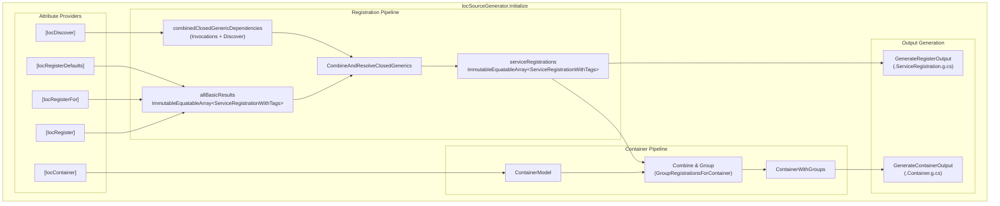

# Container Source Generator

This source generator automatically generates a compile-time IoC container based on `Ioc*` attributes. The generated container provides high-performance dependency injection without runtime reflection.

## Overview

The container generator creates a `partial class` that implements multiple DI-related interfaces, providing a complete dependency injection solution that can work standalone or integrate with `Microsoft.Extensions.DependencyInjection`.

## Supported Attributes

### Container Attribute

- `IocContainerAttribute` - Trigger generator to generate an IoC Container on a partial class

### Related Attributes

The container uses registrations from the following attributes. See [Registration.md](Registration.md) for details:

- **Registration**: `IocRegisterAttribute`, `IocRegisterForAttribute`
- **Defaults**: `IocRegisterDefaultsAttribute`
- **Module Import**: `IocImportModuleAttribute`
- **Discovery**: `IocDiscoverAttribute`
- **Injection**: `IocInjectAttribute`, `InjectAttribute`
- **Generic Factory**: `IocGenericFactoryAttribute`

## Generated Interfaces

The generated container implements the following interfaces:

|Interface|Purpose|
|:---|:---|
|`IIocContainer<TContainer>`|SourceGen.Ioc generic container interface, exposes service registry with container-typed resolvers|
|`IServiceProvider`|Standard .NET service provider|
|`IKeyedServiceProvider`|Keyed service resolution (.NET 8+)|
|`IServiceProviderIsService`|Service availability checking|
|`IServiceProviderIsKeyedService`|Keyed service availability checking|
|`ISupportRequiredService`|Required service resolution|
|`IServiceScopeFactory`|Create service scopes|
|`IServiceScope`|Represents a service scope (container is its own scope)|
|`IServiceProviderFactory<IServiceCollection>`|Build container from IServiceCollection (only when `ResolveIServiceCollection = true` AND DI package is referenced)|
|`IDisposable`|Synchronous disposal|
|`IAsyncDisposable`|Asynchronous disposal|

## Container Attribute Options

```csharp
[IocContainer(
    ResolveIServiceCollection = true,  // Allow fallback to IServiceCollection and implement IServiceProviderFactory
    ExplicitOnly = false,              // Only register explicitly marked services
    IncludeTags = ["Tag1", "Tag2"],    // Only include services with specified tags
    UseSwitchStatement = false         // Use FrozenDictionary by default; set true to use switch statement
)]
public partial class MyContainer;
```

|Property|Default|Description|
|:---|:---|:---|
|`ResolveIServiceCollection`|`true`|When true, unknown dependencies fallback to external IServiceProvider and implement `IServiceProviderFactory<IServiceCollection>`|
|`ExplicitOnly`|`false`|When true, only register services explicitly marked on the container class|
|`IncludeTags`|`[]`|When non-empty, only include services that have at least one matching tag. Services without tags are excluded.|
|`UseSwitchStatement`|`false`|When true, use cascading `if`/`switch` statements instead of `FrozenDictionary`. Only beneficial for small service counts (≤ 50).|

> **Priority**: `ExplicitOnly` takes precedence over `IncludeTags`. When `ExplicitOnly = true`, `IncludeTags` is ignored.

## Features

### 1. Basic Container Generation

Generate a container implementing all required interfaces with thread-safe singleton resolution:

```csharp
#region Define:
public interface IMyDependency;

[IocRegister<IMyDependency>(ServiceLifetime.Singleton)]
internal class MyDependency : IMyDependency;

public interface IMyService;

[IocRegister<IMyService>(ServiceLifetime.Singleton)]
internal class MyService(IMyDependency myDependency) : IMyService
{
    private readonly IMyDependency _myDependency = myDependency;
}

[IocContainer]
public partial class AppContainer;
#endregion

#region Generate:
// <auto-generated/>
#nullable enable

using System;
using System.Collections.Frozen;
using System.Collections.Generic;
using System.Linq;
using System.Threading;
using System.Threading.Tasks;
using Microsoft.Extensions.DependencyInjection;
using SourceGen.Ioc;

partial class AppContainer : IIocContainer<global::AppContainer>, IServiceProvider, IKeyedServiceProvider,
    IServiceProviderIsService, IServiceProviderIsKeyedService, ISupportRequiredService,
    IServiceScopeFactory, IServiceScope, IDisposable, IAsyncDisposable, IServiceProviderFactory<IServiceCollection>
{
    private readonly IServiceProvider? _fallbackProvider;
    private readonly bool _isRootScope = true;
    private int _disposed;

    private readonly FrozenDictionary<(Type ServiceType, object Key), Func<global::AppContainer, object>> _serviceResolvers;

    #region Constructors

    /// <summary>
    /// Creates a new standalone container without external service provider fallback.
    /// </summary>
    public AppContainer() : this((IServiceProvider?)null) { }

    /// <summary>
    /// Creates a new container with optional fallback to external service provider.
    /// </summary>
    /// <param name="fallbackProvider">Optional external service provider for unknown dependencies.</param>
    public AppContainer(IServiceProvider? fallbackProvider)
    {
        _fallbackProvider = fallbackProvider;

        _serviceResolvers = _localServices.ToFrozenDictionary();
    }

    private AppContainer(AppContainer parent)
    {
        _fallbackProvider = parent._fallbackProvider;
        _isRootScope = false;
        // Copy singleton references from parent
        _myDependency = parent._myDependency;
        _myService = parent._myService;
        _serviceResolvers = parent._serviceResolvers;
    }

    #endregion

    #region Service Resolution

    private global::MyDependency? _myDependency;
    private global::MyDependency GetMyDependency()
    {
        if(_myDependency is not null) return _myDependency;

        var instance = new global::MyDependency();

        return Interlocked.CompareExchange(ref _myDependency, instance, null) ?? instance;
    }

    private global::MyService? _myService;
    private global::MyService GetMyService()
    {
        if(_myService is not null) return _myService;

        var instance = new global::MyService((global::IMyDependency)GetRequiredService(typeof(global::IMyDependency)));

        return Interlocked.CompareExchange(ref _myService, instance, null) ?? instance;
    }

    #endregion

    #region IServiceProvider

    public object? GetService(Type serviceType)
    {
        if(serviceType == typeof(IServiceProvider)) return this;
        if(serviceType == typeof(IServiceScopeFactory)) return this;
        if(serviceType == typeof(AppContainer)) return this;

        if(_serviceResolvers.TryGetValue((serviceType, KeyedService.AnyKey), out var resolver))
            return resolver(this);

        return _fallbackProvider?.GetService(serviceType);
    }

    #endregion

    #region IKeyedServiceProvider

    public object? GetKeyedService(Type serviceType, object? serviceKey)
    {
        var key = serviceKey ?? KeyedService.AnyKey;

        if(_serviceResolvers.TryGetValue((serviceType, key), out var resolver))
            return resolver(this);

        return _fallbackProvider is IKeyedServiceProvider keyed ? keyed.GetKeyedService(serviceType, serviceKey) : null;
    }

    public object GetRequiredKeyedService(Type serviceType, object? serviceKey)
    {
        return GetKeyedService(serviceType, serviceKey) ?? throw new InvalidOperationException($"No service for type '{serviceType}' with key '{serviceKey}' has been registered.");
    }

    #endregion

    #region ISupportRequiredService

    public object GetRequiredService(Type serviceType)
    {
        return GetService(serviceType) ?? throw new InvalidOperationException($"No service for type '{serviceType}' has been registered.");
    }

    #endregion

    #region IServiceProviderIsService

    public bool IsService(Type serviceType)
    {
        if(serviceType == typeof(IServiceProvider)) return true;
        if(serviceType == typeof(IServiceScopeFactory)) return true;
        if(serviceType == typeof(AppContainer)) return true;

        if(_serviceResolvers.ContainsKey((serviceType, KeyedService.AnyKey))) return true;

        return _fallbackProvider is IServiceProviderIsService isService && isService.IsService(serviceType);
    }

    public bool IsKeyedService(Type serviceType, object? serviceKey)
    {
        var key = serviceKey ?? KeyedService.AnyKey;

        if(_serviceResolvers.ContainsKey((serviceType, key))) return true;

        return _fallbackProvider is IServiceProviderIsKeyedService isKeyed && isKeyed.IsKeyedService(serviceType, serviceKey);
    }

    #endregion

    #region IServiceScopeFactory

    public IServiceScope CreateScope() => new AppContainer(this);

    public AsyncServiceScope CreateAsyncScope() => new(CreateScope());

    IServiceProvider IServiceScope.ServiceProvider => this;

    #endregion

    #region IIocContainer

    public IReadOnlyCollection<KeyValuePair<(Type ServiceType, object Key), Func<global::AppContainer, object>>> Services => _serviceResolvers;

    private static readonly KeyValuePair<(Type, object), Func<global::AppContainer, object>>[] _localServices =
    [
        new((typeof(global::MyDependency), KeyedService.AnyKey), static c => c.GetMyDependency()),
        new((typeof(global::IMyDependency), KeyedService.AnyKey), static c => c.GetMyDependency()),
        new((typeof(global::MyService), KeyedService.AnyKey), static c => c.GetMyService()),
        new((typeof(global::IMyService), KeyedService.AnyKey), static c => c.GetMyService()),
    ];

    #endregion

    #region IServiceProviderFactory<IServiceCollection>

    /// <summary>
    /// Creates a new container builder (returns the same IServiceCollection).
    /// </summary>
    public IServiceCollection CreateBuilder(IServiceCollection services) => services;

    /// <summary>
    /// Creates the service provider from the built IServiceCollection.
    /// </summary>
    public IServiceProvider CreateServiceProvider(IServiceCollection containerBuilder)
    {
        var fallbackProvider = containerBuilder.BuildServiceProvider();
        return new AppContainer(fallbackProvider);
    }

    #endregion

    #region Disposal

    public void Dispose()
    {
        if(Interlocked.Exchange(ref _disposed, 1) != 0) return;

        if(!_isRootScope)
        {
            return;
        }

        DisposeService(_myService);
        DisposeService(_myDependency);
    }

    public async ValueTask DisposeAsync()
    {
        if(Interlocked.Exchange(ref _disposed, 1) != 0) return;

        if(!_isRootScope)
        {
            return;
        }

        await DisposeServiceAsync(_myService);
        await DisposeServiceAsync(_myDependency);
    }

    private static async ValueTask DisposeServiceAsync(object? service)
    {
        if(service is IAsyncDisposable asyncDisposable) await asyncDisposable.DisposeAsync();
        else if(service is IDisposable disposable) disposable.Dispose();
    }

    private static void DisposeService(object? service)
    {
        if(service is IDisposable disposable) disposable.Dispose();
    }

    #endregion
}
#endregion
```

### 2. Service Lifetime Management

The container supports all three service lifetimes:

|Lifetime|Storage|Scope Behavior|
|:---|:---|:---|
|Singleton|Root container field|Shared across all scopes|
|Scoped|Scope-local field|New instance per scope|
|Transient|None|New instance per resolution|

```csharp
#region Define:
[IocRegister<ISingleton>(ServiceLifetime.Singleton)]
public class SingletonService : ISingleton;

[IocRegister<IScoped>(ServiceLifetime.Scoped)]
public class ScopedService : IScoped;

[IocRegister<ITransient>(ServiceLifetime.Transient)]
public class TransientService : ITransient;

[IocContainer]
public partial class AppContainer;
#endregion

#region Generate:
partial class AppContainer
{
    private AppContainer(AppContainer parent)
    {
        _fallbackProvider = parent._fallbackProvider;
        _isRootScope = false;
        // Copy only singleton references from parent
        _singletonService = parent._singletonService;
        // _scopedService is NOT copied - each scope has its own
        _serviceResolvers = parent._serviceResolvers;
    }

    #region Service Resolution

    // Singleton - stored in root, shared across scopes
    private global::SingletonService? _singletonService;
    private global::SingletonService GetSingletonService()
    {
        if(_singletonService is not null) return _singletonService;

        var instance = new global::SingletonService();

        return Interlocked.CompareExchange(ref _singletonService, instance, null) ?? instance;
    }

    // Scoped - stored in each scope instance
    private global::ScopedService? _scopedService;
    private global::ScopedService GetScopedService()
    {
        if(_scopedService is not null) return _scopedService;

        var instance = new global::ScopedService();

        return Interlocked.CompareExchange(ref _scopedService, instance, null) ?? instance;
    }

    // Transient - no storage, created every time
    private global::TransientService GetTransientService()
    {
        return new global::TransientService();
    }

    #endregion
}
#endregion
```

### 3. Keyed Service Support

Full support for keyed services with various key types.

> **Note**: The example below shows `UseSwitchStatement = true` style for clarity. By default, keyed services are also resolved via `FrozenDictionary` using the composite key `(Type, object)`.

```csharp
#region Define:
public interface ICache;

[IocRegister<ICache>(ServiceLifetime.Singleton, Key = "memory")]
public class MemoryCache : ICache;

[IocRegister<ICache>(ServiceLifetime.Singleton, Key = "redis")]
public class RedisCache : ICache;

[IocRegister<ICache>(ServiceLifetime.Singleton, Key = CacheType.Distributed, KeyType = KeyType.Value)]
public class DistributedCache : ICache;

public enum CacheType { Memory, Distributed }

[IocContainer]
public partial class AppContainer;
#endregion

#region Generate:
partial class AppContainer
{
    // Note: In actual generated code, fields are placed above their resolver methods.
    // This example focuses on the GetKeyedService implementation.
    private MemoryCache? _memoryCache;
    private RedisCache? _redisCache;
    private DistributedCache? _distributedCache;

    public object? GetKeyedService(Type serviceType, object? serviceKey)
    {
        if (serviceType == typeof(ICache))
        {
            return serviceKey switch
            {
                "memory" => GetMemoryCache(),
                "redis" => GetRedisCache(),
                CacheType.Distributed => GetDistributedCache(),
                _ => _fallbackProvider is IKeyedServiceProvider keyed
                    ? keyed.GetKeyedService(serviceType, serviceKey)
                    : null
            };
        }

        return _fallbackProvider is IKeyedServiceProvider keyed2
            ? keyed2.GetKeyedService(serviceType, serviceKey)
            : null;
    }

    public bool IsKeyedService(Type serviceType, object? serviceKey)
    {
        if (serviceType == typeof(ICache))
        {
            return serviceKey is "memory" or "redis" or CacheType.Distributed;
        }

        return _fallbackProvider is IServiceProviderIsKeyedService isKeyed
            && isKeyed.IsKeyedService(serviceType, serviceKey);
    }
}
#endregion
```

### 4. Constructor, Property, and Method Injection

Support for all injection patterns consistent with Registration generator:

```csharp
#region Define:
[IocRegister<IMyService>(ServiceLifetime.Scoped)]
public class MyService : IMyService
{
    private readonly IDependency _dep;

    // Constructor injection
    public MyService(IDependency dep, [FromKeyedServices("special")] ISpecial special)
    {
        _dep = dep;
    }

    // Property injection
    [IocInject]
    public ILogger Logger { get; set; } = default!;

    [IocInject(Key = "config")]
    public IConfiguration? Config { get; set; }

    // Method injection
    [IocInject]
    public void Initialize(IInitializer init, [ServiceKey] object? key)
    {
        // ...
    }
}

[IocContainer]
public partial class AppContainer;
#endregion

#region Generate:
partial class AppContainer
{
    // Field and lock for complex initialization (property/method injection)
    private global::MyService? _myService;
    private readonly Lock _myServiceLock = new();
    private global::MyService GetMyService()
    {
        if(_myService is not null) return _myService;

        lock(_myServiceLock)
        {
            if(_myService is not null) return _myService;

            var instance = new global::MyService((global::IDependency)GetRequiredService(typeof(global::IDependency)), (global::ISpecial)GetRequiredKeyedService(typeof(global::ISpecial), "special"))
            {
                Logger = (global::ILogger)GetRequiredService(typeof(global::ILogger)),
                Config = GetKeyedService(typeof(global::IConfiguration), "config") as global::IConfiguration,
            };
            instance.Initialize((global::IInitializer)GetRequiredService(typeof(global::IInitializer)), null);

            _myService = instance;
            return instance;
        }
    }
}
#endregion
```

### 5. Decorator Pattern Support

Decorators are resolved in the correct order. When decorators are present, the field type is the service type (interface) rather than the implementation type.

> **Note**: The `GetService` snippet below shows `UseSwitchStatement = true` style. The decorator resolution logic (`GetHandler`) remains the same regardless of the resolution strategy.

```csharp
#region Define:
public interface IHandler;

[IocRegister<IHandler>(ServiceLifetime.Scoped, Decorators = [typeof(LoggingDecorator), typeof(CachingDecorator)])]
public class Handler : IHandler;

public class LoggingDecorator(IHandler inner, ILogger logger) : IHandler;
public class CachingDecorator(IHandler inner, ICache cache) : IHandler;

[IocContainer]
public partial class AppContainer;
#endregion

#region Generate:
partial class AppContainer
{
    public object? GetService(Type serviceType)
    {
        if(serviceType == typeof(Handler)) return GetHandler();
        if(serviceType == typeof(IHandler)) return GetHandler();
        // ...
    }

    #region Service Resolution

    // Field and lock are placed directly above the resolver method for better readability
    // Field type is IHandler (service type) when decorators are present
    private global::IHandler? _handler;
    private readonly Lock _handlerLock = new();
    private global::IHandler GetHandler()
    {
        if(_handler is not null) return _handler;

        lock(_handlerLock)
        {
            if(_handler is not null) return _handler;

            // Create the inner implementation
            global::IHandler instance = new global::Handler();

            // Apply decorators in order
            // Order in attribute: [LoggingDecorator, CachingDecorator]
            // Wrapping order: CachingDecorator(LoggingDecorator(Handler))
            instance = new global::LoggingDecorator(instance, (global::ILogger)GetRequiredService(typeof(global::ILogger)));
            instance = new global::CachingDecorator(instance, (global::ICache)GetRequiredService(typeof(global::ICache)));

            _handler = instance;
            return instance;
        }
    }

    #endregion
}
#endregion
```

### 6. Module Import

Import registrations from other containers marked with `IocImportModuleAttribute`. By default, the container uses `FrozenDictionary` to combine services from all sources.

#### FrozenDictionary

The `IIocContainer.Services` property from imported modules is used to build the combined dictionary at runtime:

```csharp
#region Define:
// In SharedModule assembly
[IocContainer]
public partial class SharedModule1;

[IocContainer]
public partial class SharedModule2;

// In main application
[IocImportModule<SharedModule1>]
[IocImportModule<SharedModule2>]
[IocContainer]
public partial class AppContainer;
#endregion

#region Generate:
partial class AppContainer : IIocContainer<global::AppContainer>, IServiceProvider, /* ... */
{
    private readonly global::SharedModule1 _sharedModule1;
    private readonly global::SharedModule2 _sharedModule2;
    private readonly FrozenDictionary<(Type ServiceType, object Key), Func<global::AppContainer, object>> _serviceResolvers;

    public AppContainer() : this((IServiceProvider?)null) { }

    public AppContainer(IServiceProvider? fallbackProvider)
    {
        _fallbackProvider = fallbackProvider;
        _sharedModule1 = new global::SharedModule1(fallbackProvider);
        _sharedModule2 = new global::SharedModule2(fallbackProvider);

        // Build FrozenDictionary from local services and imported modules
        // Module resolvers are wrapped to pass the correct module instance
        // Local services take precedence (added last, will override imported)
        _serviceResolvers = _sharedModule1.Services.Select(static kvp => 
                new KeyValuePair<(Type, object), Func<global::AppContainer, object>>(kvp.Key, c => kvp.Value(c._sharedModule1)))
            .Concat(_sharedModule2.Services.Select(static kvp => 
                new KeyValuePair<(Type, object), Func<global::AppContainer, object>>(kvp.Key, c => kvp.Value(c._sharedModule2))))
            .Concat(_localServices)
            .ToFrozenDictionary();
    }

    private AppContainer(AppContainer parent)
    {
        _fallbackProvider = parent._fallbackProvider;
        _isRootScope = false;
        // Create scopes for imported modules (so their scoped services are properly isolated)
        _sharedModule1 = (global::SharedModule1)parent._sharedModule1.CreateScope().ServiceProvider;
        _sharedModule2 = (global::SharedModule2)parent._sharedModule2.CreateScope().ServiceProvider;
        _serviceResolvers = parent._serviceResolvers;
    }

    // Local services array with container-typed resolvers
    private static readonly KeyValuePair<(Type, object), Func<global::AppContainer, object>>[] _localServices =
    [
        new((typeof(global::ILocalService1), KeyedService.AnyKey), static c => c.GetLocalService1()),
        new((typeof(global::ILocalService2), KeyedService.AnyKey), static c => c.GetLocalService2()),
        // ... more local services
    ];

    #region IIocContainer

    public IReadOnlyCollection<KeyValuePair<(Type ServiceType, object Key), Func<global::AppContainer, object>>> Services => _serviceResolvers;

    #endregion

    #region IServiceProvider

    public object? GetService(Type serviceType)
    {
        if(serviceType == typeof(IServiceProvider)) return this;
        if(serviceType == typeof(IServiceScopeFactory)) return this;
        if(serviceType == typeof(AppContainer)) return this;

        if(_serviceResolvers.TryGetValue((serviceType, KeyedService.AnyKey), out var resolver))
            return resolver(this);

        return _fallbackProvider?.GetService(serviceType);
    }

    #endregion

    #region IKeyedServiceProvider

    public object? GetKeyedService(Type serviceType, object? serviceKey)
    {
        var key = serviceKey ?? KeyedService.AnyKey;

        if(_serviceResolvers.TryGetValue((serviceType, key), out var resolver))
            return resolver(this);

        return _fallbackProvider is IKeyedServiceProvider keyed ? keyed.GetKeyedService(serviceType, serviceKey) : null;
    }

    #endregion
}
#endregion
```

#### UseSwitchStatement = true

When `UseSwitchStatement` is set to `true`, the container uses cascading calls to imported modules instead:

```csharp
#region Define:
[IocImportModule<SharedModule>]
[IocContainer(UseSwitchStatement = true)]
public partial class AppContainer;
#endregion

#region Generate:
partial class AppContainer
{
    private readonly SharedModule _sharedModule;

    public AppContainer(IServiceProvider? fallbackProvider)
    {
        _fallbackProvider = fallbackProvider;
        _sharedModule = new SharedModule(fallbackProvider);
    }

    public object? GetService(Type serviceType)
    {
        // Try local services first
        if (serviceType == typeof(ILocalService)) return GetLocalService();
        // ... more local services

        // Try imported modules
        var moduleResult = _sharedModule.GetService(serviceType);
        if (moduleResult is not null) return moduleResult;

        // Fallback to external provider
        return _fallbackProvider?.GetService(serviceType);
    }
}
#endregion
```

### 7. Factory and Instance Registration

Support for custom factory methods and static instances:

```csharp
#region Define:
public interface IConnection;

public static class ConnectionFactory
{
    public static IConnection Create(IServiceProvider sp)
    {
        var config = sp.GetRequiredService<IConfig>();
        return new Connection(config.ConnectionString);
    }

    public static readonly IConnection Default = new Connection("default");
}

[IocRegisterFor<IConnection>(ServiceLifetime.Singleton, Factory = nameof(ConnectionFactory.Create))]
[IocRegisterFor<IConnection>(ServiceLifetime.Singleton, Key = "default", Instance = nameof(ConnectionFactory.Default))]
[IocContainer]
public partial class AppContainer;
#endregion

#region Generate:
partial class AppContainer
{
    #region Service Resolution

    private global::IConnection? _connection;
    private global::IConnection GetConnection()
    {
        if(_connection is not null) return _connection;

        var instance = (global::IConnection)global::ConnectionFactory.Create(this);

        return Interlocked.CompareExchange(ref _connection, instance, null) ?? instance;
    }

    private global::IConnection? _defaultConnection;
    private global::IConnection GetDefaultConnection()
    {
        if(_defaultConnection is not null) return _defaultConnection;

        var instance = global::ConnectionFactory.Default;

        return Interlocked.CompareExchange(ref _defaultConnection, instance, null) ?? instance;
    }

    #endregion
}
#endregion
```

### 8. Open Generic Support

Handle open generic registrations with closed generic resolution.

> **Note**: The `GetService` snippet below shows `UseSwitchStatement = true` style for clarity.

```csharp
#region Define:
public interface IRepository<T>;

[IocRegister(ServiceLifetime.Scoped, ServiceTypes = [typeof(IRepository<>)])]
public class Repository<T> : IRepository<T>;

// Discovered via GetService<IRepository<User>>() call or [IocDiscover]
[IocDiscover<IRepository<User>>]
[IocDiscover<IRepository<Order>>]
[IocContainer]
public partial class AppContainer;
#endregion

#region Generate:
partial class AppContainer
{
    #region Service Resolution

    private global::Repository<global::User>? _repositoryUser;
    private global::Repository<global::User> GetRepositoryUser()
    {
        if(_repositoryUser is not null) return _repositoryUser;

        var instance = new global::Repository<global::User>();

        return Interlocked.CompareExchange(ref _repositoryUser, instance, null) ?? instance;
    }

    private global::Repository<global::Order>? _repositoryOrder;
    private global::Repository<global::Order> GetRepositoryOrder()
    {
        if(_repositoryOrder is not null) return _repositoryOrder;

        var instance = new global::Repository<global::Order>();

        return Interlocked.CompareExchange(ref _repositoryOrder, instance, null) ?? instance;
    }

    #endregion

    public object? GetService(Type serviceType)
    {
        // Closed generic resolution
        if(serviceType == typeof(global::IRepository<global::User>)) return GetRepositoryUser();
        if(serviceType == typeof(global::IRepository<global::Order>)) return GetRepositoryOrder();
        if(serviceType == typeof(global::Repository<global::User>)) return GetRepositoryUser();
        if(serviceType == typeof(global::Repository<global::Order>)) return GetRepositoryOrder();
        // ...
    }
}
#endregion
```

### 9. Collection Resolution

Support for `IEnumerable<T>` resolution when multiple implementations are registered for a service type. Collection resolvers are generated and registered in `_localServices`.

> **Note**: Collection resolution only generates for service types with multiple distinct implementations (excluding self-registrations).

```csharp
#region Define:
public interface IPlugin;

[IocRegister<IPlugin>(ServiceLifetime.Singleton)]
public class Plugin1 : IPlugin;

[IocRegister<IPlugin>(ServiceLifetime.Singleton)]
public class Plugin2 : IPlugin;

[IocContainer]
public partial class AppContainer;
#endregion

#region Generate:
partial class AppContainer
{
    #region Service Resolution

    private global::Plugin1? _plugin1;
    private global::Plugin1 GetPlugin1()
    {
        if(_plugin1 is not null) return _plugin1;

        var instance = new global::Plugin1();

        return Interlocked.CompareExchange(ref _plugin1, instance, null) ?? instance;
    }

    private global::Plugin2? _plugin2;
    private global::Plugin2 GetPlugin2()
    {
        if(_plugin2 is not null) return _plugin2;

        var instance = new global::Plugin2();

        return Interlocked.CompareExchange(ref _plugin2, instance, null) ?? instance;
    }

    // Collection resolver for IEnumerable<IPlugin>
    private global::System.Collections.Generic.IEnumerable<global::IPlugin> GetAllIPlugin() =>
    [
        GetPlugin1(),
        GetPlugin2(),
    ];

    #endregion

    // Registered in _localServices
    private static readonly KeyValuePair<(Type, object), Func<global::AppContainer, object>>[] _localServices =
    [
        new((typeof(global::Plugin1), KeyedService.AnyKey), static c => c.GetPlugin1()),
        new((typeof(global::IPlugin), KeyedService.AnyKey), static c => c.GetPlugin1()),
        new((typeof(global::Plugin2), KeyedService.AnyKey), static c => c.GetPlugin2()),
        new((typeof(global::System.Collections.Generic.IEnumerable<global::IPlugin>), KeyedService.AnyKey), static c => c.GetAllIPlugin()),
    ];
}
#endregion
```

## Configuration Options Behavior

### ResolveIServiceCollection = false

When disabled, the container operates in standalone mode without fallback to external `IServiceProvider`.

> **Note**: The `GetService` snippet below shows `UseSwitchStatement = true` style for clarity.

```csharp
#region Define:
[IocContainer(ResolveIServiceCollection = false)]
public partial class StandaloneContainer;
#endregion

#region Generate:
partial class StandaloneContainer
{
    // No fallback provider field

    #region Constructors

    public StandaloneContainer()
    {
        _serviceResolvers = _localServices.ToFrozenDictionary();
    }

    #endregion

    public object? GetService(Type serviceType)
    {
        if(serviceType == typeof(IServiceProvider)) return this;
        if(serviceType == typeof(IServiceScopeFactory)) return this;
        if(serviceType == typeof(StandaloneContainer)) return this;

        if(_serviceResolvers.TryGetValue((serviceType, KeyedService.AnyKey), out var resolver))
            return resolver(this);

        return null;
    }
}
#endregion
```

**Analyzer Diagnostic**: When a dependency cannot be resolved and `ResolveIServiceCollection = false`, report error `SGIOC018: Unable to resolve service '{ServiceType}' for container '{ContainerType}'.`

### ExplicitOnly = true

Only register services explicitly marked on the container class:

```csharp
#region Define:
// These are NOT registered (not on container class)
[IocRegister<IService1>]
public class Service1 : IService1;

// This IS registered (on container class)
[IocRegisterFor<IService2, Service2>(ServiceLifetime.Singleton)]
[IocContainer(ExplicitOnly = true)]
public partial class ExplicitContainer;
#endregion
```

### IncludeTags

When `IncludeTags` is non-empty, the container only includes services that have at least one matching tag. Services without any tags or with non-matching tags are excluded.

> **Note**: `ExplicitOnly` takes precedence over `IncludeTags`. When `ExplicitOnly = true`, `IncludeTags` is ignored.

```csharp
#region Define:
// This IS registered (has matching tag "Feature1")
[IocRegister<IService1>(ServiceLifetime.Singleton, Tags = ["Feature1"])]
public class Service1 : IService1;

// This IS registered (has matching tag "Feature2")
[IocRegister<IService2>(ServiceLifetime.Singleton, Tags = ["Feature2", "Feature3"])]
public class Service2 : IService2;

// This is NOT registered (no matching tag)
[IocRegister<IService3>(ServiceLifetime.Singleton, Tags = ["Feature3"])]
public class Service3 : IService3;

// This is NOT registered (no tags defined)
[IocRegister<IService4>(ServiceLifetime.Singleton)]
public class Service4 : IService4;

[IocContainer(IncludeTags = ["Feature1", "Feature2"])]
public partial class FeatureContainer;
#endregion
```

**Use Cases**:

1. **Feature Flags**: Include/exclude features at compile time based on build configurations
2. **Module Separation**: Create specialized containers for different deployment scenarios
3. **Testing**: Create test containers with only specific tagged services

### IServiceProviderFactory Implementation

When `ResolveIServiceCollection = true` **AND** the `Microsoft.Extensions.DependencyInjection` package is referenced, the container implements `IServiceProviderFactory<IServiceCollection>` to integrate with ASP.NET Core and other hosts:

```csharp
#region Define:
[IocContainer(ResolveIServiceCollection = true)]
public partial class AppContainer;
#endregion

#region Generate:
partial class AppContainer : IServiceProviderFactory<IServiceCollection>, /* ... other interfaces */
{
    private readonly IServiceProvider? _fallbackProvider;

    /// <summary>
    /// Creates a new container builder (returns the same IServiceCollection).
    /// </summary>
    public IServiceCollection CreateBuilder(IServiceCollection services) => services;

    /// <summary>
    /// Creates the service provider from the built IServiceCollection.
    /// </summary>
    public IServiceProvider CreateServiceProvider(IServiceCollection containerBuilder)
    {
        // Build the fallback provider from IServiceCollection
        var fallbackProvider = containerBuilder.BuildServiceProvider();
        return new AppContainer(fallbackProvider);
    }
}
#endregion
```

**Usage with ASP.NET Core:**

```csharp
var builder = WebApplication.CreateBuilder(args);

// Use the generated container as the service provider factory
builder.Host.UseServiceProviderFactory(new AppContainer());

var app = builder.Build();
```

**Usage with Generic Host:**

```csharp
var host = Host.CreateDefaultBuilder(args)
    .UseServiceProviderFactory(new AppContainer())
    .Build();
```

## Thread Safety

All service resolution is thread-safe using `Interlocked.CompareExchange`. Service fields are placed directly above their resolver methods for better readability:

```csharp
private global::MyService? _myService;
private global::MyService GetMyService()
{
    if(_myService is not null) return _myService;

    var instance = new global::MyService(/* ... */);

    return Interlocked.CompareExchange(ref _myService, instance, null) ?? instance;
}
```

For complex initialization (property/method injection or decorators), use double-check locking:

```csharp
// Field and lock placed directly above the resolver method
// Uses System.Threading.Lock (.NET 9+) for better performance
private global::MyService? _myService;
private readonly Lock _myServiceLock = new();
private global::MyService GetMyService()
{
    if(_myService is not null) return _myService;

    lock(_myServiceLock)
    {
        if(_myService is not null) return _myService;

        var instance = new global::MyService(/* ... */)
        {
            Property = (global::IDependency)GetRequiredService(typeof(global::IDependency)),
        };
        instance.Initialize(/* ... */);

        _myService = instance;
        return instance;
    }
}
```

## Service Resolution Strategy

When resolving services, the container follows this order:

1. **Built-in services**: `IServiceProvider`, `IServiceScopeFactory`, container type itself
2. **Local services**: Services registered in this container
3. **Imported modules**: Services from `IocImportModuleAttribute`
4. **Fallback provider**: External `IServiceProvider` (if `ResolveIServiceCollection = true`)

For duplicate registrations (same service type and key):

- **Local wins**: Local registrations override imported ones
- **Last wins**: For multiple local registrations, the last one wins (consistent with MS.DI)

## Disposal Order

Services are disposed in reverse registration order:

1. Scoped services (when scope is disposed)
2. Singleton services (when root container is disposed)
3. Imported module containers

```csharp
public void Dispose()
{
    if(Interlocked.Exchange(ref _disposed, 1) != 0) return;

    if(!_isRootScope)
    {
        DisposeService(_scopedService2);
        DisposeService(_scopedService1);
        _sharedModule.Dispose();
        return;
    }

    DisposeService(_singletonService2);
    DisposeService(_singletonService1);
    _sharedModule.Dispose();
}

public async ValueTask DisposeAsync()
{
    if(Interlocked.Exchange(ref _disposed, 1) != 0) return;

    if(!_isRootScope)
    {
        await DisposeServiceAsync(_scopedService2);
        await DisposeServiceAsync(_scopedService1);
        await _sharedModule.DisposeAsync();
        return;
    }

    await DisposeServiceAsync(_singletonService2);
    await DisposeServiceAsync(_singletonService1);
    await _sharedModule.DisposeAsync();
}

private static async ValueTask DisposeServiceAsync(object? service)
{
    if(service is IAsyncDisposable asyncDisposable) await asyncDisposable.DisposeAsync();
    else if(service is IDisposable disposable) disposable.Dispose();
}

private static void DisposeService(object? service)
{
    if(service is IDisposable disposable) disposable.Dispose();
}
```

## Performance Optimization

### Service Resolution Key Structure

All service lookups use a composite key `(Type ServiceType, object Key)`:

- For non-keyed services: `Key = KeyedService.AnyKey`
- For keyed services: `Key = actual key value`

This unified key structure allows both keyed and non-keyed services to be stored in the same dictionary.

### Resolution Strategy Comparison

|Strategy|Default|When to Use|
|:---|:---|:---|
|`FrozenDictionary`|✓|Most cases, O(1) lookup|
|`UseSwitchStatement`||Small service counts (≤ 50), may have better JIT optimization|

See [Basic Container Generation](#1-basic-container-generation) for FrozenDictionary examples and [Keyed Service Support](#3-keyed-service-support) for switch statement examples.

## Implementation Requirements

### Output File Naming

The generated container source file is named: `{ClassName}.Container.g.cs`

For example, a container class `AppContainer` will generate `AppContainer.Container.g.cs`.

### Source Generator Architecture

The Container generator is implemented as part of `IocSourceGenerator` using the Incremental Generator pattern. It adds a new pipeline and output alongside the existing Registration generator.

```filetree
IocSourceGenerator.cs
├── Initialize() - Main pipeline configuration
│   ├── Existing Registration pipelines
│   │   ├── RegisterAttribute providers
│   │   ├── RegisterForAttribute providers
│   │   ├── DefaultSettings providers
│   │   └── ImportModule providers
│   └── Container pipeline
│       ├── ContainerAttribute provider
│       ├── Combine with serviceRegistrations
│       ├── GroupRegistrationsForContainer
│       └── RegisterSourceOutput for Container
├── TransformRegister.cs
├── TransformContainer.cs
├── GroupRegistrationsForContainer.cs
├── GenerateRegisterOutput.cs
└── GenerateContainerOutput.cs
```

### Pipeline Design

```csharp
// In IocSourceGenerator.Initialize()

// ========== IocContainerAttribute provider ==========
var containerProvider = context.SyntaxProvider
    .ForAttributeWithMetadataName(
        Constants.IocContainerAttributeFullName,
        predicate: static (node, _) => node is ClassDeclarationSyntax,
        transform: static (ctx, ct) => TransformContainer(ctx, ct))
    .Where(static m => m is not null)
    .Select(static (m, _) => m!);

// Combine container with existing serviceRegistrations and group them
var containerWithGroups = containerProvider
    .Combine(serviceRegistrations)
    .Select(static (source, _) => GroupRegistrationsForContainer(source.Left, source.Right));

// Combine with compilation info and MSBuild properties
var containerWithCompilationInfo = containerWithGroups
    .Combine(compilationInfoProvider)
    .Combine(msbuildPropertiesProvider);

// Generate Container output (separate from Registration output)
context.RegisterSourceOutput(containerWithCompilationInfo, static (ctx, source) =>
{
    var ((containerWithGroups, compilationInfo), msbuildProps) = source;
    GenerateContainerOutput(in ctx, containerWithGroups, compilationInfo.AssemblyName, msbuildProps, compilationInfo.HasDIPackage);
});
```

### Target Framework Requirements

The generated code requires .NET 8.0 or later.

### File Organization

```filetree
src/SourceGen.Ioc.SourceGenerator/
├── Generator/
│   ├── IocSourceGenerator.cs              # Main generator with both pipelines
│   ├── TransformRegister.cs               # Transform [IocRegister*] attributes
│   ├── TransformContainer.cs              # Transform [IocContainer]
│   ├── GroupRegistrationsForContainer.cs  # Group registrations for container generation
│   ├── GenerateRegisterOutput.cs          # Generate registration code
│   ├── GenerateContainerOutput.cs         # Generate container code
│   └── Spec/
│       ├── Registration.md                # Registration specification
│       └── Container.md                   # This specification
├── Models/
│   ├── ContainerModel.cs                  # Container data model
│   ├── ContainerWithGroups.cs             # Container with pre-computed groups
│   ├── ServiceRegistrationModel.cs        # Service registration model
│   ├── TypeData.cs                        # Type information model
│   └── ...
└── Analyzer/
    └── SPEC.md                            # Analyzer specifications
```

### Data Flow



### Generation Logic

#### Service Filtering for ExplicitOnly Mode

When `ExplicitOnly = true`, only include registrations that are:

1. Directly marked on the container class via `[IocRegisterFor]`
2. Included via `[IocRegisterDefaults]` on the container class
3. Imported via `[IocImportModule]` on the container class

#### Service Filtering for IncludeTags Mode

When `IncludeTags` is non-empty (and `ExplicitOnly = false`), apply tag filtering:

1. Include services where `Tags` has at least one element in common with `IncludeTags`
2. Exclude services with empty `Tags` array
3. Exclude services where `Tags` has no intersection with `IncludeTags`
4. Services from imported modules via `[IocImportModule]` are NOT filtered by `IncludeTags` (they are included as-is)

**Filtering Priority**:

```markdown
ExplicitOnly = true  →  Only explicit registrations (IncludeTags ignored)
ExplicitOnly = false AND IncludeTags non-empty  →  Tag filtering applied
ExplicitOnly = false AND IncludeTags empty  →  All registrations included
```

### Analyzer Diagnostics

|ID|Severity|Message|Trigger|
|:---|:---|:---|:---|
|`SGIOC018`|Error|Unable to resolve service '{ServiceType}' for container '{ContainerType}'|Unresolvable dependency when `ResolveIServiceCollection = false`|
|`SGIOC019`|Error|Container class '{ClassName}' must be declared as partial|Missing `partial` keyword|
